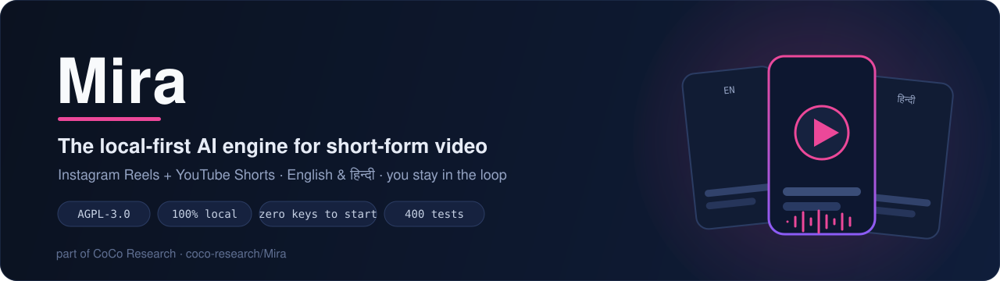
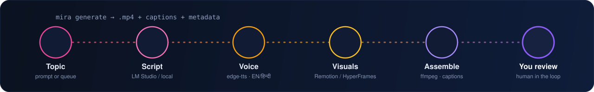
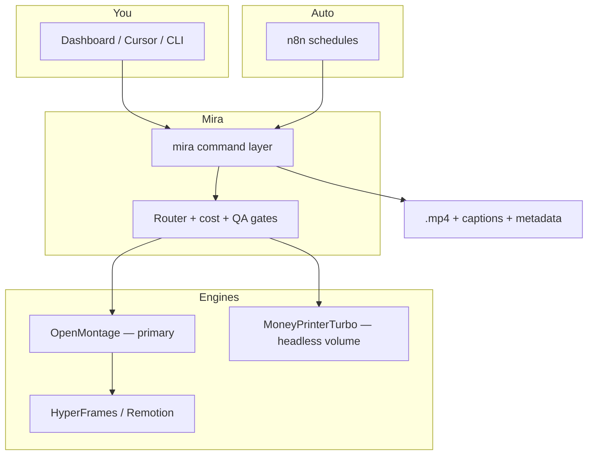

<p align="center">
  
</p>

<p align="center">
  
  
  
  
  
</p>

<p align="center">
  <b>Generate consistent, high-quality Instagram Reels &amp; YouTube Shorts — in English and Hindi — from one local command.</b><br>
  <sub>Faceless channels and personal-brand content · automate the busywork · you keep the taste and the final say</sub>
</p>

<p align="center">
  <a href="#why-mira">Why</a> ·
  <a href="#how-it-works">How it works</a> ·
  <a href="#production-lanes">Lanes</a> ·
  <a href="#quick-start">Quick start</a> ·
  <a href="#architecture">Architecture</a> ·
  <a href="#license">License</a>
</p>

---

## Why Mira

Short-form video is a volume game, but volume kills quality — and most "AI video" tools are cloud black boxes that take your keys, your footage, and your money. **Mira flips that:** it runs the whole pipeline **on your machine**, generates a real `.mp4` with **zero API keys** to start, and keeps a **human in the loop** on the things that matter — so you get consistency *and* taste, not slop at scale.

- 🖥️ **Local-first** — keys, media, and rendering stay on your machine. No telemetry, no SaaS lock-in.
- 🎬 **Two engines, one router** — a quality engine for hero content, a headless engine for trusted auto-volume; the router picks the path by channel trust.
- 🗣️ **English & हिन्दी** — script and voice in both, with localization-dub from an English source.
- 🆓 **Zero keys to start** — no key → LM Studio + edge-tts + local Remotion/HyperFrames fallback. Add keys only when you want more.
- ✅ **Tested** — a stdlib-only command layer with **400 passing tests** as the seam under every feature.

## How it works

<p align="center">
  
</p>

One command runs the chain end-to-end and hands you a finished vertical video plus captions and metadata — then stops for your review before anything ships:

```bash
mira generate --topic "three free AI tools every student should know"
```

## Production lanes

Mira isn't one template — it routes a topic down the right lane for the channel:

| Lane | What it makes | For |
|------|---------------|-----|
| 🎞️ **Faceless** | Designed motion graphics or stock B-roll + TTS | High-volume faceless channels |
| 🎥 **Cinematic / story** | Veo-interpolation chain (StoryGen-style) | Hero pieces |
| 👤 **Personal brand** | Your footage → clip-factory + captions | Founders, creators |
| ✨ **Premium AI** | Motion transfer / lip-sync (metered, gated) | Standout drops |
| 🌐 **Hindi** | Localization-dub from an English source | Bilingual reach |

---

## Quick start

**Prerequisites:** Python 3.11+ (developed on 3.14) · `ffmpeg`/`ffprobe` on `PATH` · optional: LM Studio (local scripts), Node (Remotion/HyperFrames renders).

```bash
cd mira
python3 -m venv .venv && source .venv/bin/activate
pip install -e ".[dev]"

cp .env.example .env    # optional keys — blank = free fallback
mira up                 # API + dashboard + local engine supervisor
```

Open the dashboard at `http://localhost:8765`, then generate from **Studio** or the CLI:

```bash
mira generate --topic "three free AI tools every student should know"
mira bench    --topic "three free AI tools every student should know"   # Remotion vs HyperFrames
```

**Zero API keys required** — with no keys, Mira uses LM Studio (if running), edge-tts voice, and local Remotion/HyperFrames visuals. Full setup tiers (keys, engines, posting): **[`mira/SETUP.md`](mira/SETUP.md)**.

```bash
cd mira && .venv/bin/python -m pytest     # 400 tests — stdlib-only core, no wheel risk on 3.14
```

---

## Architecture



**Two engines, one router.** OpenMontage is the in-the-loop quality engine (pipelines, provider selection, checkpoints). MoneyPrinterTurbo handles trusted faceless auto-volume. Channel trust level picks the path.

**Design principles:** local-first execution · the command layer is the test seam (JSON in/out before UI) · graceful degradation (missing key → free fallback, never a crash) · cost-aware (budget caps + live meter) · Mac-primary, Windows-supported (RAM/VRAM tier probe).

<details>
<summary><b>Repo layout &amp; documentation map</b></summary>

```
.
├── mira/                  ← Python package (mira CLI + providers + pipeline)
│   ├── SETUP.md           ← step-by-step setup (start here after clone)
│   ├── BUILD_LOG.md       ← append-only build history
│   └── tests/             ← 400 pytest tests
├── dashboard/             ← UI prototype + partials
├── plan/                  ← strategy, specs, ADRs (PLAN, DASHBOARD_SPEC, DEV_PLAN, DECISIONS, SECURITY, LAUNCH)
├── repos/                 ← bundled engine source (see THIRD-PARTY.md)
├── n8n/                   ← workflow exports (mira_daily.json)
└── scripts/               ← setup-engines.sh (fetch external engines)
```

Read in order: [`mira/SETUP.md`](mira/SETUP.md) → [`plan/PLAN.md`](plan/PLAN.md) → [`plan/DASHBOARD_SPEC.md`](plan/DASHBOARD_SPEC.md) → [`plan/DEV_PLAN.md`](plan/DEV_PLAN.md) → [`plan/DECISIONS.md`](plan/DECISIONS.md) → [`plan/SECURITY.md`](plan/SECURITY.md) → [`plan/LAUNCH.md`](plan/LAUNCH.md).

</details>

---

## License

**Mira is licensed under [AGPL-3.0](LICENSE).** Copyright © 2026 Coco Inc. If you run a modified Mira as a network service, AGPL §13 requires you to offer users the complete corresponding source.

Mira bundles several upstream engines under their own (compatible) licenses and references two more externally. Full attribution + pinned upstreams: [`THIRD-PARTY.md`](THIRD-PARTY.md).

| Engine | License | Status |
|--------|---------|--------|
| OpenMontage, locally-uncensored | AGPL-3.0 | Bundled (`repos/`) |
| MoneyPrinterTurbo, Open-Generative-AI, Free-ai-video-generator | MIT | Bundled (`repos/`) |
| Wan2.2, hyperframes, StoryGen-Atelier | Apache-2.0 | Bundled (`repos/`) |
| n8n | Sustainable Use License (fair-code) | External — `bash scripts/setup-engines.sh` |
| SkyReels-V2 | Skywork Community License | External — `bash scripts/setup-engines.sh` |
| AVTR-1 | Goodsize model license | Dropped (AGPL-incompatible + commercial trigger) |

---

## Status

| Area | State |
|------|-------|
| `mira` command layer | Phase 0 complete — 400 tests green |
| Offline generate pipeline | Working — real `.mp4` with no keys |
| Stock B-roll + caption burn | Working with a Pexels key |
| Dashboard prototype | Shell + partials; wiring in progress |
| Publish / pod / cloud GPU | Planned (DEV_PLAN phases 5–8) |

## Contributing

Open-source under AGPL-3.0; contributions welcome via PR to `main`. Please don't commit `.env`, `media/`, or generated video artifacts, and append context to [`mira/BUILD_LOG.md`](mira/BUILD_LOG.md) after meaningful changes.

<sub>Part of <a href="https://github.com/coco-research">CoCo Research</a> — open-core AI orchestration &amp; agentic developer tooling.</sub>
