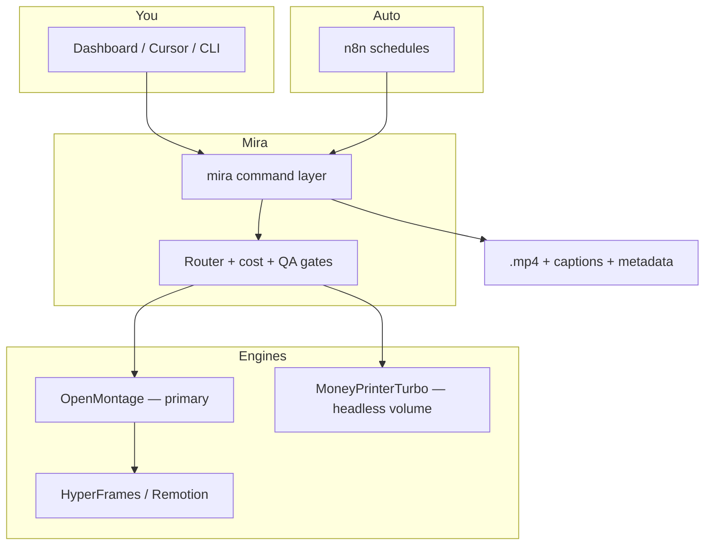

# Mira

**An AI video content engine** for producing consistent, high-quality short-form video (Instagram Reels + YouTube Shorts) in **English and Hindi** — faceless channels and personal-brand content, built to automate topics while keeping you in the loop.

> **Automation · Quality · Consistency**

---

## What this repo is

Mira is a **local-first** production stack: a Python command layer (`mira`), a dashboard UI, orchestration workflows, and vendored engine repos — wired together so you can generate, review, and (eventually) publish video from one place.

| Layer | Path | Role |
|-------|------|------|
| **Command layer** | [`mira/`](mira/) | CLI + API — scripts, voice, visuals, assembly, cost tracking, routing (400 tests) |
| **Dashboard** | [`dashboard/`](dashboard/) | Anthropic-styled UI prototype → full product per spec |
| **Planning** | [`plan/`](plan/) | Architecture, UI spec, dev phases, ADRs, security, launch playbook |
| **Engines** | [`repos/`](repos/) | OpenMontage (primary), MoneyPrinterTurbo, HyperFrames, and supporting repos |
| **Automation** | [`n8n/`](n8n/) | Scheduled headless runs (daily workflow JSON) |

**Current focus:** Quality Lab — generate great videos locally first. Publishing (YouTube/Instagram), Supabase pod mode, and cloud GPU burst are planned but not active yet. See [`mira/SETUP.md`](mira/SETUP.md).

---

## Quick start

### Prerequisites

- **Python 3.11+** (developed on 3.14)
- **ffmpeg** / **ffprobe** on `PATH`
- Optional: **LM Studio** (local scripts), **Node** (Remotion/HyperFrames renders)

### Install & run

```bash
cd mira
python3 -m venv .venv
source .venv/bin/activate
pip install -e ".[dev]"

cp .env.example .env   # optional keys — blank = free fallback
mira up                # starts API + dashboard + local engine supervisor
```

Open the dashboard (default `http://localhost:8765`), then generate from **Studio** or the CLI:

```bash
mira generate --topic "three free AI tools every student should know"
mira bench --topic "three free AI tools every student should know"  # compare Remotion vs HyperFrames
```

**Zero API keys required.** With no keys, Mira uses LM Studio (if running), edge-tts voice, and local Remotion/HyperFrames visuals.

Full setup tiers (keys, engines, posting): **[`mira/SETUP.md`](mira/SETUP.md)**

### Tests

```bash
cd mira && .venv/bin/python -m pytest
# 400 tests — stdlib-only core, no wheel risk on 3.14
```

---

## Architecture (high level)



**Two engines, one router.** OpenMontage is the in-the-loop quality engine (pipelines, provider selection, checkpoints). MoneyPrinterTurbo handles trusted faceless auto-volume. Channel trust level picks the path.

**Production lanes** (see [`plan/PLAN.md`](plan/PLAN.md)):

- **Faceless** — designed motion graphics or stock B-roll + TTS
- **Cinematic / story** — StoryGen-style Veo interpolation chain (hero pieces)
- **Personal brand** — your footage → clip-factory + captions
- **Premium AI** — motion transfer / lip-sync (metered, gated)
- **Hindi** — localization-dub from English source

---

## Repo layout

```
.
├── README.md              ← you are here
├── mira/                  ← Python package (mira CLI + providers + pipeline)
│   ├── SETUP.md           ← step-by-step setup (start here after clone)
│   ├── BUILD_LOG.md       ← append-only build history for agents/humans
│   └── tests/             ← 400 pytest tests
├── dashboard/             ← UI prototype + partials (Anthropic design language)
├── plan/                  ← strategy, specs, ADRs
│   ├── PLAN.md            ← architecture bible
│   ├── DASHBOARD_SPEC.md  ← 13-screen product spec
│   ├── DEV_PLAN.md        ← phased build + test gates
│   ├── DECISIONS.md       ← ADR log
│   └── repos/             ← per-engine deep-dives (markdown)
├── repos/                 ← vendored engine source (forks of upstream projects)
│   ├── OpenMontage/       ← primary engine (AGPL)
│   ├── MoneyPrinterTurbo/ ← headless volume (MIT)
│   ├── hyperframes/       ← composition runtime (Apache-2.0)
│   └── …                  ← see plan/repos/README.md for full index
├── n8n/                   ← workflow exports
└── research/              ← scratch (optional)
```

After clone, install engine dependencies per engine README (e.g. `npm install` in OpenMontage/remotion-composer). `node_modules/` and `.venv/` are gitignored.

---

## Documentation map

Read in this order:

1. **[`mira/SETUP.md`](mira/SETUP.md)** — get from zero to first video
2. **[`plan/PLAN.md`](plan/PLAN.md)** — strategy, lanes, cost model, roadmap
3. **[`plan/DASHBOARD_SPEC.md`](plan/DASHBOARD_SPEC.md)** — UI screens and flows
4. **[`plan/DEV_PLAN.md`](plan/DEV_PLAN.md)** — build phases and test gates
5. **[`plan/DECISIONS.md`](plan/DECISIONS.md)** — why we chose what we chose
6. **[`plan/SECURITY.md`](plan/SECURITY.md)** — secrets, RLS, licensing posture
7. **[`plan/LAUNCH.md`](plan/LAUNCH.md)** — channels, topics, week-1 run sheet
8. **[`plan/repos/README.md`](plan/repos/README.md)** — engine deep-dives

---

## Design principles

- **Local-first execution** — keys, media, and rendering stay on your machine. Cloud (future) only coordinates pod state.
- **Command layer is the test seam** — every feature is a `mira` command with JSON in/out before UI wiring.
- **Graceful degradation** — missing API key → free/offline fallback, never a hard crash.
- **Cost-aware** — metered providers behind budget caps and a live cost meter.
- **Mac-primary, Windows-supported** — RAM/VRAM probe assigns Heavy/Mid/Light tiers.

---

## License notes

This monorepo **vendors** multiple upstream projects with different licenses. Respect each engine's terms before commercial use:

| Engine | License | Note |
|--------|---------|------|
| OpenMontage, locally-uncensored | AGPL-3.0 | Copyleft applies if you distribute modified software |
| MoneyPrinterTurbo, Open-Generative-AI, StoryGen-Atelier, HyperFrames | MIT / Apache-2.0 | Generally permissive |
| AVTR-1 | PolyForm Noncommercial | Paid license needed for monetized channels |
| SkyReels-V2 | Skywork Community | Read license before commercial reliance |

Details: [`plan/SECURITY.md`](plan/SECURITY.md) and [`plan/repos/`](plan/repos/).

---

## Contributing

This is a **private** Coco Research project. Work happens on `main` via PRs. Do not commit `.env`, `media/`, or generated video artifacts.

**Agent/human handoff:** append context to [`mira/BUILD_LOG.md`](mira/BUILD_LOG.md) after meaningful tasks.

---

## Status

| Area | State |
|------|-------|
| `mira` command layer | Phase 0 complete — 400 tests green |
| Offline generate pipeline | Working — real `.mp4` with no keys |
| Stock B-roll + caption burn | Working with Pexels key |
| Dashboard prototype | Shell + partials; wiring in progress |
| Publish / pod / cloud GPU | Planned (DEV_PLAN phases 5–8) |

---

**Organization:** [coco-research](https://github.com/coco-research) · **Repo:** `coco-research/Mira` (private)
