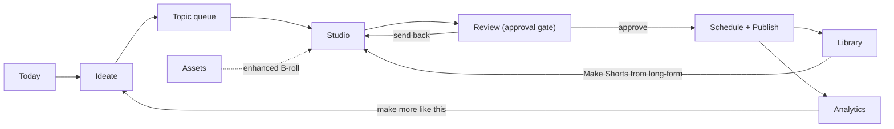
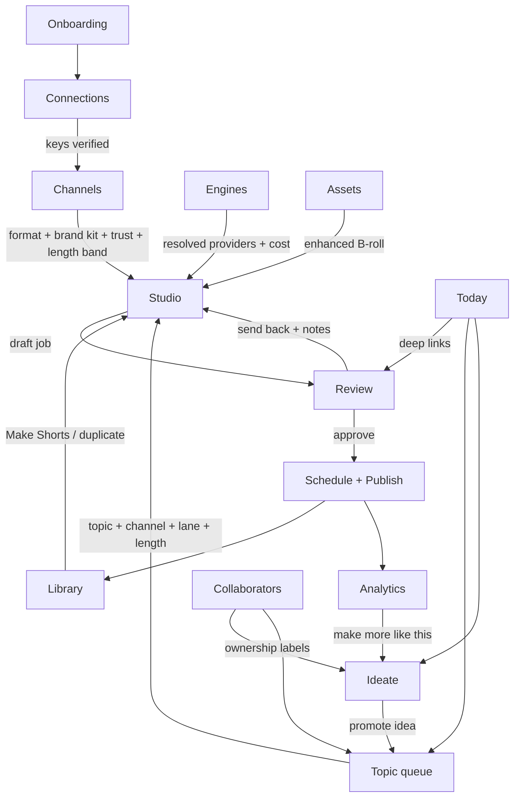
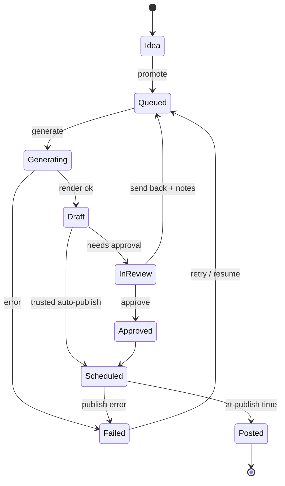
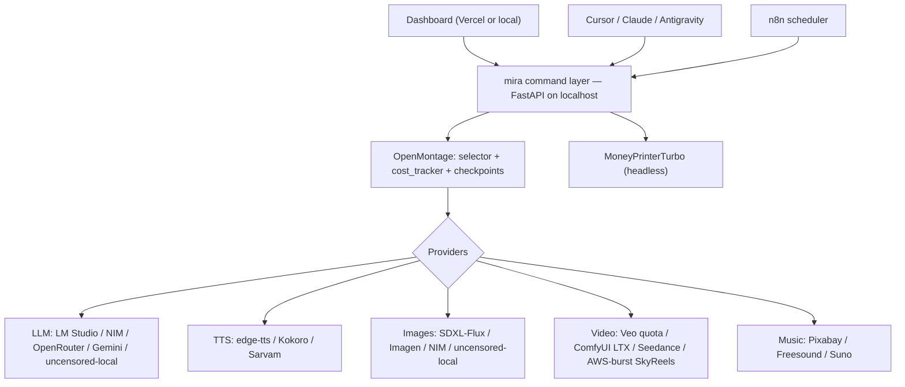
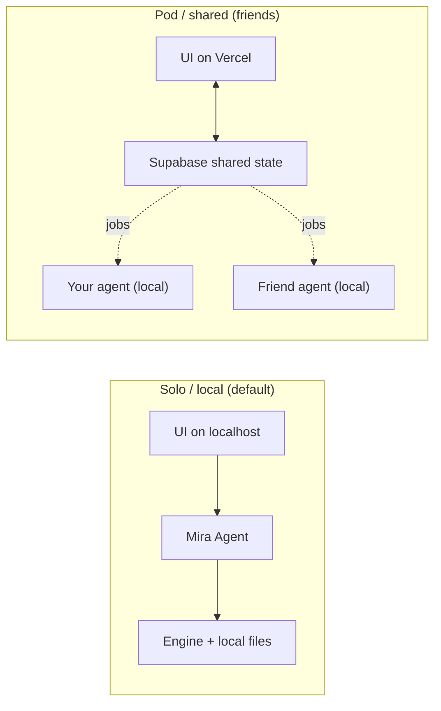

# Project Mira — Dashboard Spec (v1)

One page. Review and mark up before I build anything.

## Operating model
You drive the dashboard. n8n runs headless underneath for scheduling and retries. The engine does the work: **OpenMontage is the primary engine** (an agentic, Cursor-driven production platform — it owns pipelines, provider routing, cost tracking, and approval checkpoints), with **MoneyPrinterTurbo** as the headless engine for fully-automated faceless volume. Cursor, Claude, or Antigravity can drive the same engine when you're in those tools, because everything goes through one shared command layer (see bottom). No feature is locked inside the UI. The dashboard's Engines matrix, cost meter, and approval gate are thin surfaces over OpenMontage's selector, `cost_log.json`, and checkpoint policies — not parallel reimplementations.

**This app ships to friends too** (it's a shared hobby), so it runs in two modes — see *Deployment & distribution*. In short: the heavy engine is always **local** on each person's own Mac/Windows with their own keys; the cloud layer (Vercel UI + Supabase) only coordinates a pod and never touches keys, media, or rendering.

## Design language (Anthropic)
- Paper background `#FAF9F5`, panels `#F0EEE6`, borders `#E5E2D9`
- Ink text `#141413`, secondary `#6B6B66`
- Accent (clay/coral) `#CC785C`, hover `#B85C3E`
- Serif for headings (Tiempos/Georgia fallback), clean sans for body (Inter/Styrene-like)
- Soft radius (10–12px), generous whitespace, subtle shadows, calm and editorial. No neon, no gradients.

## Global elements (every screen)
- Header shows a live **cost meter**: month-to-date spend on metered services, against a budget cap you set. Turns amber near the cap, red over it. Local/free work shows as $0. **Click to expand** into a per-service breakdown vs budget (Veo quota, Kling/MuAPI, Sarvam, Blotato) plus a **learned forecast** ("at this pace you hit the cap in ~11 days"). Predictions come from the learning estimator (see Cost intelligence).
- Header shows the active account, a **channel filter** (All / per channel) that scopes Today, Library, and Analytics, and a quick "New video" button.

## Navigation / information architecture
Sidebar is grouped by the journey, not a flat list. Landing screen is **Today**.
- **Today** (landing command center)
- **Plan**: Ideate · Topic queue
- **Create**: Studio · Assets
- **Ship**: Review · Library
- **Grow**: Analytics
- **Configure**: Channels · Engines · Connections · Collaborators
- **Onboarding wizard** is a first-run overlay, not a sidebar item (re-runnable from Connections).

The daily loop the nav is built around:

## Screens (journey order)

### 0. Today (command center) — landing
- Purpose: the daily home. Answers "what needs me right now" in one glance; becomes exception-first once channels are trusted.
- Elements: greeting + date; a row of stat tiles (**To review**, **Scheduled today**, **Spend MTD vs cap**, **Ideas waiting**, **Failures/alerts**); "Needs your attention" list (review items + any failed/low-confidence/over-budget runs); today's schedule timeline; fresh-ideas peek (from Ideate); per-channel pulse (mini stats). Empty state nudges "Make your first video."
- Actions: jump to Review batch, retry a failure, promote an idea, open Studio.
- Calls: `mira today` (aggregates status, queue, cost, alerts).

### 1. Onboarding wizard (first run, guided)
- Purpose: get from zero to first video without a settings maze.
- Steps: (1) welcome; (2) **LM Studio auto-detect** at `localhost:1234` + **RAM/VRAM/GPU probe** that assigns a machine tier (Heavy/Mid/Light) and pre-routes engines accordingly, pick a script model that fits; (3) optional keys (Gemini, Pexels, Sarvam, YouTube) each skippable with "what this unlocks"; (4) **budget cap** (feeds the cost meter); (5) **first channel** (format Faceless/Personal, niche, language, voice, cadence). Finish → Today with a "Make your first video" nudge.
- Note: engines are pre-set to recommended defaults here; retune later on Engines.
- Calls: `mira detect lmstudio`, `mira test-connection`, `mira channels add`.

### 2. Ideate / Discover
- Purpose: where topics come from — fixes the "automation of topics" pillar.
- Elements: an always-on **quick-capture** box (sharable from phone); an **Ideas inbox** of cards, each with a source badge (From niche / YouTube trending / Google Trends / Reddit / News-RSS / Competitor), target channel, and an optional AI fit + saturation score; filter chips by source/channel; "Trend research last ran 2h ago" status (n8n background job).
- Actions: capture an idea, keep/dismiss/merge, **promote to Queue**, run trend research now, **paste a reference video/screenshot** (MiniMax-M3 on NIM, free, watches it and seeds 2-3 idea cards).
- Calls: `mira ideas list|add|promote`, `mira trends run`, `mira ideas from-ref <url>`.

### 3. Topic queue (calendar + list)
- Purpose: the consistency engine, made visible.
- Elements: a **weekly calendar** (default) with per-slot chips (channel color + lane + language) and a flat list view toggle; "Suggest topics" (local LLM proposes 10); per-slot lane + language.
- Actions: add topic, accept suggestions, drag to schedule, **bulk-generate the week**.
- Calls: `mira queue add|list`, `mira suggest-topics --channel <id>`, `mira generate --batch`.

### 4. Studio (generate)
- Purpose: make one video.
- Elements: pick channel + topic (with inline "suggest"), a **target length** control prefilled from the channel band (drives the script word budget), choose a lane — **only lanes valid for the channel's format show** (faceless = stock / designed graphics / AI clips / **cinematic story** (StoryGen interpolation-chain, Veo-quota, gated as quota-heavy); personal = film yourself / talking-head from photo), plus the optional **premium motion-transfer lane** (Open-Generative-AI + Kling, metered, likeness/music guardrail). A resolved-engines strip shows which engine runs each step with a per-video override and a **learned cost + ETA preview per lane** ("≈ $0.42, ±15%, ~2 min, from your last 9 runs"). Then a progress strip: script → voice → visuals → **music** → captions → **packaging** → done. **Packaging** auto-produces 2–3 **thumbnail** options + title/description/tags-hashtags variants (localized for the channel language), and a music bed is auto-picked from the brand kit (overridable). You can also pull from the **Assets library** (your enhanced photos/clips) as B-roll.
- Actions: generate, cancel, override an engine for this run, adjust length for this video, upload footage, pick thumbnail/title, swap music bed.
- Long-form channels (16:9, 3–5 min): Studio shows a **section/chapter outline** with scene count and total est duration + cost, and generates via the explainer/documentary pipeline; the short 9:16 lanes don't apply.
- Calls: `mira generate --channel <id> --topic "<t>" --lane <lane> [--engine stage=provider]`; `mira status <job>`.

### 4b. Assets (My media) — the personal-brand loop
- Purpose: turn **your own photos and clips** into reusable, enhanced B-roll — your original "give me my footage, enhance it, use it" ask.
- Elements: a media grid (your uploads + generated assets) with tags (you / location / b-roll / logo), an **enhance** panel (upscale · face-restore · color-grade · denoise · stabilize), and **animate a still → motion B-roll** (image-to-video via LTX on Mac or Veo on quota). Shows which channels/videos reuse each asset.
- Actions: upload, enhance, animate, tag, mark reusable, delete. Enhanced assets become selectable B-roll in Studio for any lane.
- Calls: `mira assets list|add|enhance|animate`.

### 5. Review (To review + Audit)
- Purpose: approval gate, on by default; trusted channels auto-publish but still land in the Audit tab.
- Elements: two tabs. **To review** = a batch swipe-through (big player + 90-second checklist incl. **final duration in-band** + script + **thumbnail/title picker** (choose among generated variants) + an **AI-disclosure toggle** for realistic synthetic media, "1 of 3", next), Approve / Send back with a note. **Audit** = list of auto-published videos with confidence flags for after-the-fact spot checks.
- Actions: approve → schedule/publish, reject → send back, pick thumbnail/title, toggle disclosure, flag an audited video.
- Calls: `mira publish <id>`, `mira reject <id> --note`, `mira review queue`.

### 6. Library
- Purpose: history and status.
- Elements: **channel + language filter chips**; grid of past videos with thumbnail, channel, language, status (draft/approved/posted), platform links.
- Actions: re-download, repost, duplicate as a new topic, **"Make Shorts from this"** on a long-form video (runs `clip-factory` → 4–10 vertical clips into the Shorts channels).
- Calls: `mira library list [--channel] [--lang]`, `mira clip-factory <video_id>`.

### 7. Channels
- Purpose: define each channel once; it's the identity that constrains Studio lanes.
- Elements: card per channel showing **format** (Faceless / Personal), **video type** (Short-form 9:16 / Long-form 16:9), niche, language, voice, visual style, cadence, **target length band + hard cap** (Short 30–45s, cap 60s; Long-form 3–5 min), **trust level** (Always review / Auto-publish when trusted), **engine overrides** summary, per-channel mini stats, an assigned collaborator, and a **brand kit** (intro/outro stings, logo/watermark, caption font + style + color, palette, default music bed, title-card template) that every render inherits for visual consistency. "New channel" button.
- Actions: create/edit/archive, set format + video type, set target length band, **edit brand kit**, assign collaborator, flip trust, pin engine overrides.
- Calls: `mira channels add|list|edit`.

### 8. Engines (provider / compute routing)
- Purpose: choose which engine runs each pipeline stage, layered as global defaults → per-channel overrides → per-video override in Studio.
- Elements: a routing matrix, one row per stage, options with the default marked and a badge (Local / Free / Metered / Quota) + cost hint:
  - Script LLM: LM Studio local (default) / NVIDIA NIM free (MiniMax-M3 multimodal · Nemotron 3 · GLM/Kimi · Sarvam-M for HI) / **OpenRouter** (free/cheap routing) / **Mistral La Plateforme** (~1B tok/mo) / **Groq** / **Cerebras** (fast) / **Cloudflare Workers AI** / **GitHub Models** (frontier, tight caps) / HuggingFace local / Gemini free / **Uncensored local (abliterated GGUF — no refusals on edgy-but-legal creative)** — the free pool is curated from `cheahjs/free-llm-api-resources` (accessed 2026-06-19); all OpenAI-compatible overflow the swarm rotates
  - Voice EN: edge-tts (default) / local Kokoro / ElevenLabs
  - Voice HI: Sarvam (default) / edge-tts hi-IN free
  - Images: local SDXL-Flux on Mac / Imagen / Gemini / NIM (FLUX, Qwen-Image) / **Uncensored local SDXL/Flux checkpoint (ComfyUI)**
  - AI video: Veo on quota (heroes) / ComfyUI Mac LTX (volume) / Seedance 2.0 Mini (cheap draft/insert) / **cloud-burst (Vultr free-credit GPU → AWS) → SkyReels-V2 14B or Wan** (warning + auto-return-to-local) — note: NIM hosts only Cosmos physics video, not creator short-form, so it's not an option here
  - Motion transfer: Open-Generative-AI + Kling 3 Turbo Motion Control (default) / local Wan2.2-Animate / Viggle free
  - Music / audio: Pixabay/Freesound free (default) / local `music_gen` / Suno (metered) — royalty-free only
  - Thumbnail + metadata: image model (Imagen/Flux/Qwen-Image) + script LLM for title/desc/tags/hashtags (auto-localized EN/HI)
  - Captions: faster-whisper local (default)
  - Posting: YouTube Data API / Blotato / IG Graph
  - **Production engine** row: OpenMontage (in-the-loop, default) / MoneyPrinterTurbo (headless volume), steered by channel trust level. Both run until the Phase 1 bake-off retires one.
- Actions: set a global default per stage; reset to recommended; scope selector (Global / per-channel).
- **Backed by OpenMontage**: the matrix is rendered from OpenMontage's live registry (`tool_registry.provider_menu()` / `support_envelope()`), not a hardcoded list. Setting a default writes a preference the `tts/image/video_selector` honors. The cost meter reads `cost_log.json`; the approval gate maps to checkpoint policy (`guided` / `manual_all` / `auto_noncreative`). `mira` is a thin wrapper.
- **NIM caveat surfaced in UI**: NIM rows carry a "free · dev tier (~40 req/min)" hint; if a NIM call 429s, the selector falls back to the next provider automatically. MiniMax-M3 shows a small non-commercial-license flag for the monetization phase.
- **Uncensored-local option**: the uncensored Script-LLM/Images choices carry an "edgy-but-legal creative — no refusals" hint and are the sensible per-channel default for horror/satire/mature channels. Selecting them changes nothing about publishing: the platform content-policy + AI-disclosure check still runs at the Review/publish gate for every engine.
- **New providers appear automatically**: because rows render from `provider_menu()`, new metered models (e.g., Seedance 2.5, Kling updates, a Nano-Banana image API) show up as options the moment OpenMontage registers a tool for them — no UI change needed. Each is tagged draft vs hero and priced into the cost preview.
- **Cloud-burst policy**: a global "Allow cloud burst" toggle (default on, with a spend warning). Bursting to a GPU (**Vultr free-credit GPU first, then AWS** — SkyReels-V2 14B / Wan) happens only when the Mac is saturated/unusable or a job needs a CUDA-only/heavier model; the cost meter flags it live and tracks **remaining free Vultr credit**, and the system **auto-switches back to local and tears down the GPU** as soon as load drops. The burst threshold and a hard burst budget cap are configurable here.
- **Tier-aware defaults (RAM management)**: the matrix shows this machine's detected tier (Heavy/Mid/Light from the RAM/VRAM/GPU probe) and pre-selects providers that fit — Light machines default heavy stages to cloud endpoints (NIM/OpenRouter/Gemini/Veo). If a chosen local provider wouldn't fit in free RAM, the selector **auto-downgrades** (smaller quant/res) or **offloads** (cloud / capable pod machine) rather than OOM; a small "running lean" badge shows when it does. Concurrency caps to 1 on Mid/Light.
- **Compute swarm (pod mode)**: an **"auto-route across pod accounts"** toggle plus a **pod capacity view** — a live quota ledger (per member/provider: req/min, daily caps, Veo clips left, AWS budget left). When on, the router rotates premium-model calls (NIM/OpenRouter/Mistral/Groq/Cerebras/Cloudflare/GitHub Models) across the pod's accounts to beat any single account's rate limit, and dispatches heavy/over-quota jobs to a member with free capacity (their key stays on their machine). Policy chain: free-local → requester's own free cloud → pod swarm → metered → AWS burst. Personal-footage jobs can be pinned **local-only**; ledger keeps load fair. ToS note surfaced: free dev tiers for hobby use, switch to paid keys at monetization.
- Calls: `mira engines list|set --stage <s> --provider 
 [--channel <id>]`.

### 9. Connections
- Purpose: paste and verify keys once; re-run onboarding.
- Elements: rows for LM Studio (local, no key), NVIDIA NIM, **OpenRouter**, **Mistral La Plateforme**, **Groq**, **Cerebras**, **Cloudflare Workers AI**, **GitHub Models** (free LLM overflow pool — `cheahjs/free-llm-api-resources`, accessed 2026-06-19), ComfyUI (local), Gemini, Vertex (Veo), Pexels, Pixabay/Freesound (music), YouTube, Sarvam, **Vultr (cloud-burst GPU — free $250–300 credit, covers GPU)**, **AWS (cloud-burst GPU fallback — spend warning + auto-teardown)**, Blotato (later). Key field + "Test" button + green/red/local status dot. "Re-run setup wizard" link.
- Actions: save (local `.env`, never cloud), test connection.
- **Pod section (only in pod mode):** sign in with **Supabase Auth**, join/leave a pod by invite, and **pair this machine's Mira Agent** to the pod with a code (shows agent online/offline + which channels it runs). Keys still live in the local `.env`; pairing shares no secrets. You can **opt your own accounts into the swarm** (NIM/OpenRouter/Gemini/Veo/AWS) — only *available capacity* is published to the pod ledger, never the keys.
- Calls: `mira test-connection <service>`, `mira pod join|pair|status`, `mira pod capacity`.

### 10. Analytics (Grow)
- Purpose: close the loop — see what works and feed winners back into Ideate.
- Elements: views/retention cards per channel; a **monetization milestone tracker** (YPP: 1k subs + 4k hours, or 10M Shorts views); top performers list with a "make more like this" action.
- Actions: open a winner in Ideate as a seed, filter by channel.
- Calls: `mira analytics pull`, `mira ideas add --from <video_id>`.

### 11. Collaborators
- Purpose: the shared-engine / pod model.
- Elements: collaborator list with assigned channels and roles (research/scripts, VO/edit, schedule/community); ownership labels surface on Ideate cards and Queue items. Each collaborator shows their **agent status** (online/offline, OS, has-GPU, **RAM tier**) so you know whose machine can take a heavy job vs. who should offload.
- Actions: invite (sends a pod join + agent-install link), assign channels, set role.
- Calls: `mira collab list|assign`, `mira pod invite`.

## Screen connections & data flow
The screens aren't islands — they pass a video through a pipeline. Every tab is a stage that hands a defined object to the next.

**Handoff contracts (what data crosses each edge):**

| From → To | Trigger | Data passed |
|---|---|---|
| Onboarding/Connections → Channels | keys saved + tested | provider availability, machine tier |
| Channels → Studio | "New video" / pick channel | `channel_id` → constrains lanes, supplies brand kit + length band + trust + engine overrides |
| Engines → Studio | resolve | per-stage provider + learned cost/ETA for the strip |
| Ideate → Topic queue | promote | `idea` → `queue_item` (topic, channel, suggested lane, source) |
| Topic queue → Studio | generate / bulk-generate | `topic + channel + lane + target length` → creates a `job` |
| Assets → Studio | pick B-roll | enhanced `asset_id`s injected into the timeline |
| Studio → Review | render done | `video` (draft, with thumb/title variants, duration, cost) → state `Draft`/`InReview` |
| Review → Schedule/Library | approve | `video.status = Approved → Scheduled`; lands in Library |
| Review → Studio | send back | `video.status = Queued` + reviewer notes (which stage to redo) |
| Library → Studio | "Make Shorts" / duplicate | long-form `video_id` → `clip-factory` job(s); or topic clone |
| Schedule → Analytics | posted | `video_id` + platform IDs → metrics pull |
| Analytics → Ideate | "make more like this" | winner `video_id` → seeds a new `idea` |

**Deep-linking:** Today is the hub — every alert/tile links straight to the target screen pre-filtered (a failed job → Studio at that job; a to-review item → Review batch at that video). The global **cost meter** is a read-only subscriber: every `Generating`/`Scheduled` job writes to `cost_log.json`, the meter (and its forecast) reads it.

## Video lifecycle (the state machine everything shares)

Each state is owned by a screen: **Idea**→Ideate, **Queued**→Topic queue, **Generating/Draft**→Studio, **InReview/Approved**→Review, **Scheduled**→Topic queue + Today, **Posted**→Library + Analytics, **Failed**→Today alerts. This state field is the single source of truth the whole UI filters on.

## Cross-cutting behaviors (the previously-thin parts)

- **Failures, retries & resume:** the pipeline is **checkpointed per stage** (OpenMontage already writes intermediate artifacts), so a failed run **resumes from the last good stage** instead of restarting. Jobs have idempotent IDs; Today surfaces a failure with its cause + a one-click retry; n8n retries headless jobs with backoff.
- **Granular regeneration:** Studio/Review can re-run a **single stage** (re-voice, re-pick visuals, re-caption, re-package) without redoing the whole video — each stage reads the prior stage's saved output.
- **Scheduling engine:** each channel has a cadence + time-slots in its **timezone**; the scheduler fills slots respecting the **5–7 day buffer**, avoids double-booking a slot, and n8n cron fires the publish at slot time. Best-time hints come from Analytics once data exists.
- **Data model (core entities, for testability):** `Channel` (format, video_type, language, voice, brand_kit, length_band, trust, engine_overrides), `Idea` (text, source, target_channel, scores), `QueueItem` (topic, channel, lane, length, slot), `Job/Video` (status, lane, resolved_engines, stages[], duration, cost_est/actual, thumb/title variants, platform_ids), `Asset` (type, enhanced_from, reuse_refs), `BrandKit`, `PodMember/AgentCapacity` (tier, quotas), `CostEntry`. These are the JSON shapes the `mira` commands read/write.
- **Pod sync & conflicts:** Supabase is the coordination source of truth; UI is optimistic + Realtime. Simple fields = last-write-wins; **channel edits are locked to the owner/assigned role**; a job has exactly **one assigned agent** so it never double-runs across machines.

## Cost intelligence (learning estimator)
Wraps OpenMontage's `cost_tracker` (estimate → reserve → reconcile, `cost_log.json`) with a learning layer:
- A `cost_model.json` of rolling unit costs ($/sec Veo, $/clip Kling-Turbo, $/1k chars Sarvam, $/image), updated by an exponential moving average after every reconcile. It also learns render time.
- **Predict:** decompose a planned job into billable units (driven partly by the **target length**) → price with learned units → show in Studio per lane with a confidence range that narrows as samples grow.
- **Forecast:** the header meter projects time-to-cap and warns before a metered lane exceeds budget.
- Calls: `mira estimate <job-spec>` (predict cost + ETA); the same numbers feed Engines cost hints and the Studio preview.

## The command layer (shared by dashboard + agents + n8n)

A small local API (FastAPI on `localhost`) plus a `mira` CLI wrapping the same functions. Every front door calls these:
- `mira today` (aggregate status for the command center)
- `mira estimate <job-spec>` (learned cost + ETA prediction)
- `mira generate`, `mira status`, `mira publish`, `mira reject`
- `mira channels`, `mira queue`, `mira suggest-topics`
- `mira clip-factory <video_id>` (slice a long-form into vertical Shorts)
- `mira assets list|add|enhance|animate` (your photos/clips → enhanced reusable B-roll)
- `mira package <id>` (generate thumbnail + title/description/tags variants)
- `mira ideas list|add|promote`, `mira trends run`
- `mira engines list|set` (global / per-channel routing)
- `mira analytics pull`, `mira collab list|assign`
- `mira pod join|invite|pair|status|capacity` (pod mode: Supabase auth + agent pairing + swarm quota ledger)
- `mira route <job-spec>` (pick provider via the swarm policy chain: free-local → own cloud → pod swarm → metered → burst)
- `mira setup` (cross-platform install/bootstrap of the local agent), `mira detect <component>` (probe LM Studio/ComfyUI + RAM/GPU tier)
- `mira review queue` (review list), `mira test-connection`, `mira library`
This is why you can operate from the dashboard or just ask me in Cursor. n8n calls the same endpoints on a schedule for hands-off runs.

## Deployment & distribution (solo → pod)
The app is meant to be **handed to friends**, each on their own Mac (or Windows) with their own keys. Because the engine is inherently local (OpenMontage / ComfyUI / LM Studio / ffmpeg renders can't run on Vercel's ~60s serverless functions or Supabase), the architecture has **two planes**:
- **Execution plane — local, per person, required.** A **Mira Agent** each person installs: the `mira` FastAPI + OpenMontage + ComfyUI/LM Studio + ffmpeg. Keys live only in their **own local `.env`**; their compute does their work.
- **Coordination plane — cloud, optional, shared.** **Frontend on Vercel** (free) + **Supabase** (free: Auth + Postgres + Storage + Realtime) holding only shared coordination state (users, channels, roles/assignments, idea inbox, queue, schedule, video metadata + status, analytics/cost rollups, audit log). **No secrets, no source media, no rendering in the cloud.**

**Two run modes:**
- **Solo / local (default, prototype phase):** UI → `localhost` agent. No cloud, no Supabase.
- **Pod / shared (friends):** Vercel UI ↔ Supabase (shared state + Realtime) ↔ each friend's local agent, which **pulls only its owner's assigned jobs** and reports back metadata + a light preview. No machine reaches into another (no tunnels).

**Cross-platform:** Python + Node + ffmpeg → Mac (MLX/Metal, LTX ComfyUI) and Windows (CUDA ComfyUI, or NIM/OpenRouter/Gemini + Veo quota with no GPU). Distribute via `mira setup` or a small **Tauri/Electron tray app**. **Friend onboarding:** open Vercel URL → Supabase account → join pod by invite → install agent → run onboarding (their own keys + detect LM Studio/ComfyUI) → pair with a code.

## Stored locally vs. in the pod
- **Local (every install):** `config.json` (channels, settings), `.env` (**keys — never leave the machine**), `queue.json`, `library/` (rendered full-res videos + media). 
- **Supabase (pod mode only):** shared coordination state above + lightweight review previews. Falls back to local-only JSON in solo mode.

## Build approach
> Full phased, testable sequencing with audit gates is in [`DEV_PLAN.md`](DEV_PLAN.md). Summary:

1. Prototype: single HTML file, real Anthropic styling, fake data, all 13 screens clickable, journey-grouped nav, landing on Today. **Solo/local only — no cloud.**
2. Real app (solo): refactor to Next.js + Tailwind, wire to the local `mira` command layer + n8n on `localhost`.
3. Pod app (when friends join): host the Next.js UI on **Vercel** (free), add **Supabase** (Auth + shared coordination DB + Realtime), and package the **Mira Agent** installer for **Mac + Windows**. Each friend pairs their local agent; the UI reads/writes Supabase, agents pull their own jobs. Keys never leave each machine.

### Prototype build order (by journey value)
1. Shell: sidebar (journey groups), topbar with expandable cost meter + channel filter, page router.
2. **Today** command center (landing) — the daily home.
3. **Studio** (format-aware lanes + resolved-engines strip) — the activation moment.
4. **Review** (batch swipe + Audit tab) — the daily loop.
5. **Ideate** — quick-capture + trend-sourced cards.
6. **Topic queue** (calendar + bulk generate).
7. **Channels** (format + trust + brand kit + engine overrides + stats).
8. **Engines** matrix.
9. **Library** (filters), **Connections**.
10. **Assets** (My media: upload → enhance → animate).
11. **Analytics**, **Collaborators**.
12. **Onboarding wizard** overlay (first-run).

## Decisions locked
- Approval gate is on by default; per-channel "auto-publish when trusted" toggle. Auto-published videos still appear in Review for after-the-fact audit.
- Live cost meter in the header for metered services (Veo, AWS GPU), against a budget cap.
- Engine/provider routing is user-selectable on a dedicated Engines screen, layered as global defaults -> per-channel overrides -> per-video override in Studio. Recommended defaults are pre-selected; each option carries a Local/Free/Metered/Quota badge tied to the cost meter.

## Open (later)
- Analytics: live YouTube/IG data pull-back (prototype shows the screen with fake data; real wiring is phase 2).
- Collaborator roles/permissions enforcement — when the pod actually forms (prototype shows the view).
- **Pod / distribution stack:** Vercel-hosted UI + Supabase (Auth, shared coordination DB, Realtime, RLS per pod) + cross-platform **Mira Agent** installer (Mac + Windows) with pairing. Solo/local works without any of it; this lights up only when friends join.
