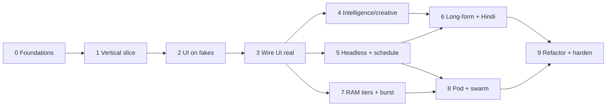

# Project Mira — Development Plan (testable, gated)

How we actually build it: **command-layer first, every part independently testable, and an audit + test gate that must pass before the next phase starts.** No phase is "done" until its gate is green.

> Companion to [`PLAN.md`](PLAN.md) (strategy/architecture) and [`DASHBOARD_SPEC.md`](DASHBOARD_SPEC.md) (UI + flows). This doc is the build/test sequencing.

---

## Build philosophy

1. **The `mira` command layer is the test seam.** Every capability is a `mira` command with typed JSON in/out *before* any UI touches it. The CLI is testable on its own; the UI is just a second caller.
2. **Fake data before wiring.** Each screen is built against fixtures first (renders + nav + actions), then swapped to real `mira` calls.
3. **Vertical slices, not horizontal layers.** Ship one channel → one lane → one real video end-to-end early, then widen.
4. **Each phase has a Definition of Done + an audit gate.** Don't proceed on red.

## Test layers (what "tested" means here)

| Layer | Scope | How to run in isolation |
|---|---|---|
| **Unit** | a function/provider adapter | pytest/vitest on pure functions (cost EMA, word-budget→duration, router policy) |
| **Contract** | one `mira` command | call the CLI, assert JSON shape vs a golden fixture |
| **Integration** | a full pipeline run | `mira generate` on a fixed sample brief → assert artifacts (ffprobe duration, captions, cost log) |
| **UI** | one screen | render against fixtures, then against the real command; visual/Anthropic check |
| **Acceptance** | a user journey | manual checklist per screen + the 90-sec QA gate |
| **Audit gate** | the whole phase | `verification-agent` + repo tests + the consistency check; security-review on pod/secrets phases |

---

## Phases (each: goal · build · test in isolation · gate)

### Phase 0 — Foundations & harness
- **Build:** stand up OpenMontage + MoneyPrinterTurbo + ComfyUI + n8n (PLAN §8 Phase 0). Scaffold the `mira` FastAPI + CLI with **stub commands returning fixtures**. Set up the test runner + golden fixtures + capability probe.
- **Test:** every stubbed `mira` command is callable and returns typed JSON; smoke test per command; `support_envelope()`/`provider_menu()` probe works.
- **Gate (DoD):** all contract tests green on stubs; engines/probe enumerated; CI runs the test suite.

### Phase 1 — Single video vertical slice (1 channel, 1 lane, local only)
- **Build:** real `mira channels add`, `mira generate` (faceless stock lane via OpenMontage), `mira status` → produces a real `.mp4`.
- **Test:** generate a known topic → assert file exists, **duration in-band (ffprobe)**, captions burned, cost logged to `cost_log.json`.
- **Gate:** 5 sample videos pass the 90-sec QA checklist; duration control verified; estimate-vs-actual cost within range.

### Phase 2 — Dashboard shell + core screens on fake data
- **Build:** single-file HTML prototype — shell (journey nav + cost meter), Today, Studio, Review, Channels, Engines — all on fixtures.
- **Test:** each screen renders; nav + deep-links work; actions call stubbed `mira`; Anthropic styling check.
- **Gate:** the clickable journey runs end-to-end on fake data; **screen handoffs verified** (promote→queue→studio→review→library) against the handoff contracts.

### Phase 3 — Wire UI to the real command layer (solo, local)
- **Build:** replace fixtures with real `mira` calls; live cost meter; real generate→review→publish (dry-run) on a throwaway channel.
- **Test:** integration — create channel, ideate, queue, generate, review, schedule (dry-run), Library shows it; **failure injection** (kill a stage) → resume from checkpoint works.
- **Gate:** full solo loop works on a test channel; resume + granular re-run (re-voice only) verified.

### Phase 4 — Intelligence & creative features (each independently)
- **Build:** length control, learning cost/ETA estimator, packaging (thumbnail + title/metadata), Assets (enhance/animate), Music lane, uncensored-local provider.
- **Test (per feature):** estimator range tightens over N runs; word-budget→duration holds within ±X%; packaging emits 2–3 variants; assets enhance round-trips + animate produces B-roll; music auto-ducks under VO.
- **Gate:** every feature has its own passing acceptance test; no regression in the Phase 3 loop.

### Phase 5 — Headless lane + automation + scheduling + bake-off
- **Build:** MoneyPrinterTurbo headless, n8n flows, scheduling engine, auto-publish for a trusted channel; run the **engine bake-off**.
- **Test:** n8n triggers `mira` on cron; a scheduled post fires at slot time (to a test/private account); bake-off comparison recorded.
- **Gate:** a trusted channel posts **hands-off for 3 days** without intervention; bake-off decision logged (keep/retire).

### Phase 6 — Long-form + Hindi + repurpose
- **Build:** long-form (3–5 min) pipeline, `localization-dub` Hindi, `clip-factory` hub-and-spoke.
- **Test:** a 3–5 min video passes long-form QA (intro <15s, cadence, chapters, thumbnail/title); Hindi dub aligns to timing; clip-factory yields N valid Shorts.
- **Gate:** one long-form → a week of Shorts verified end-to-end.

### Phase 7 — RAM tiers + cloud-burst
- **Build:** tier probe + low-RAM modes (unload/lowvram/quant-to-fit/segmented render/concurrency cap); AWS spot-GPU burst launch + auto-teardown.
- **Test:** simulate a Light tier (cap RAM) → offloads correctly, **no OOM under stress**; burst spins up, renders, **auto-tears-down** when idle.
- **Gate:** completes a full job on a 16 GB machine (or simulated cap) without crashing; burst leaves no idle instance billing.

### Phase 8 — Pod: Vercel + Supabase + pairing + swarm
- **Build:** deploy UI to Vercel; Supabase (Auth + coordination DB + Realtime + RLS); agent pairing; quota ledger + swarm router.
- **Test:** two agents (your Mac + a 2nd machine/VM) pair; a job **routes to the other agent**; rate-limit (429) failover across pooled accounts; fairness ledger updates; **verify no secrets ever land in Supabase**.
- **Gate:** the two-machine swarm completes jobs neither could alone; **security-review passes** (keys local, RLS correct, ToS-safe defaults); single-assignment prevents double-runs.

### Phase 9 — Real refactor + hardening
- **Build:** migrate prototype to Next.js + Tailwind; live Analytics pull-back (YouTube/IG OAuth); observability/logging; final security pass.
- **Gate:** `verification-agent` + `security-review` green; e2e journey passes on the real app.

---

## Dependency order (what blocks what)

## Per-phase gate ritual (run every time)
1. Run the phase's unit + contract + integration tests → all green.
2. Manual acceptance checklist for any new screen + the 90-sec QA gate for any new video output.
3. `verification-agent` audit of the changed code (TDZ/imports/dead code/anti-patterns); `security-review` on Phase 8/9.
4. Consistency check: `mira` commands ↔ screens ↔ this plan still aligned.
5. Only then start the next phase.
