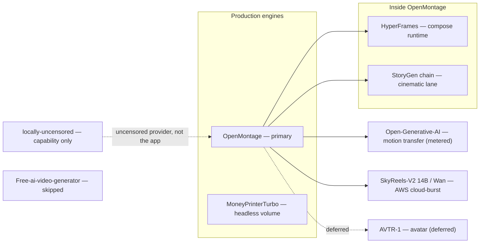
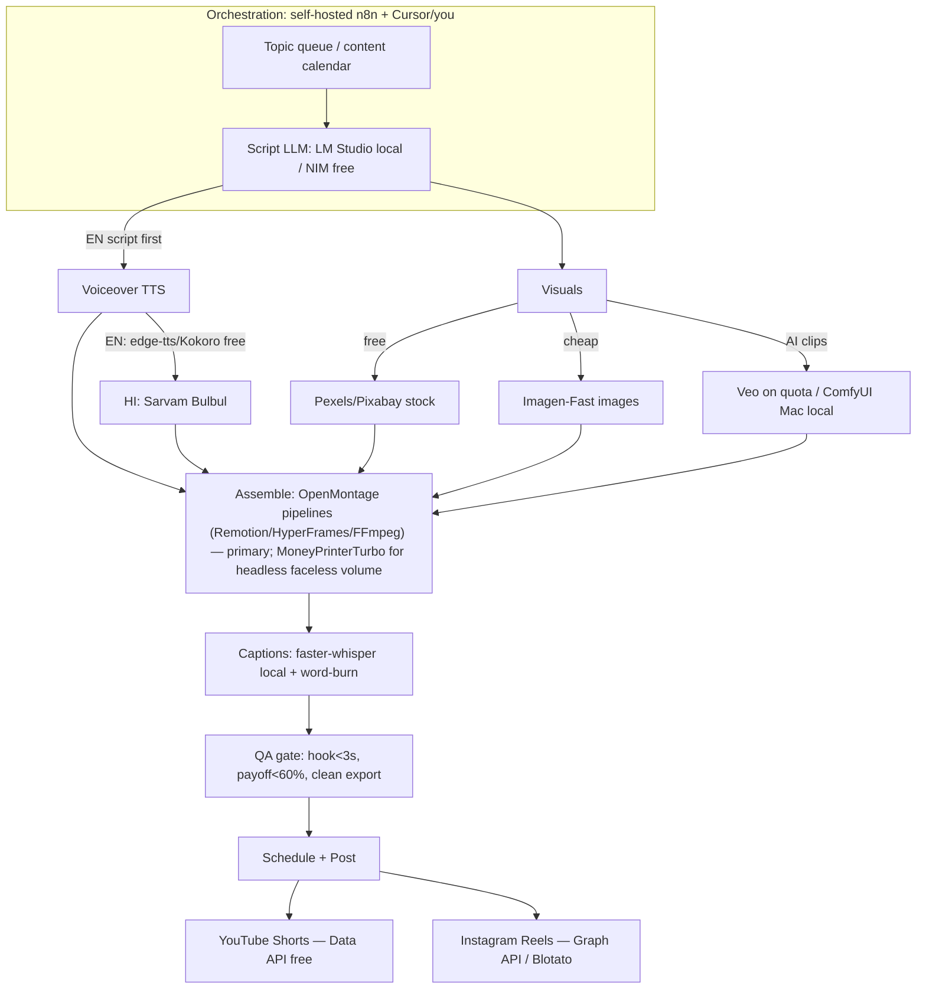
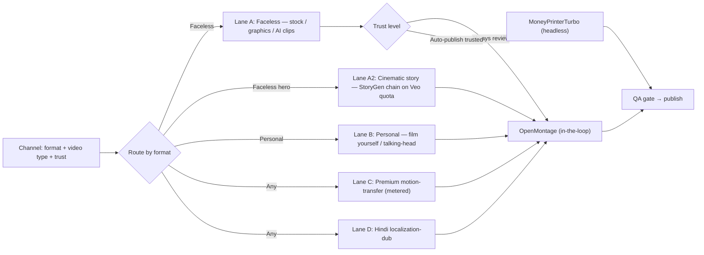
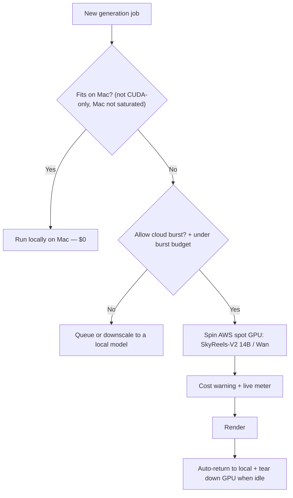
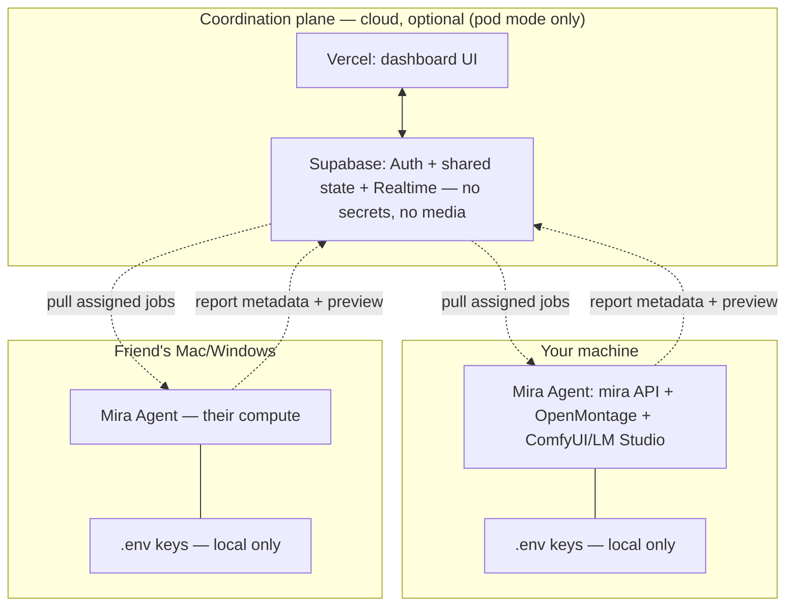
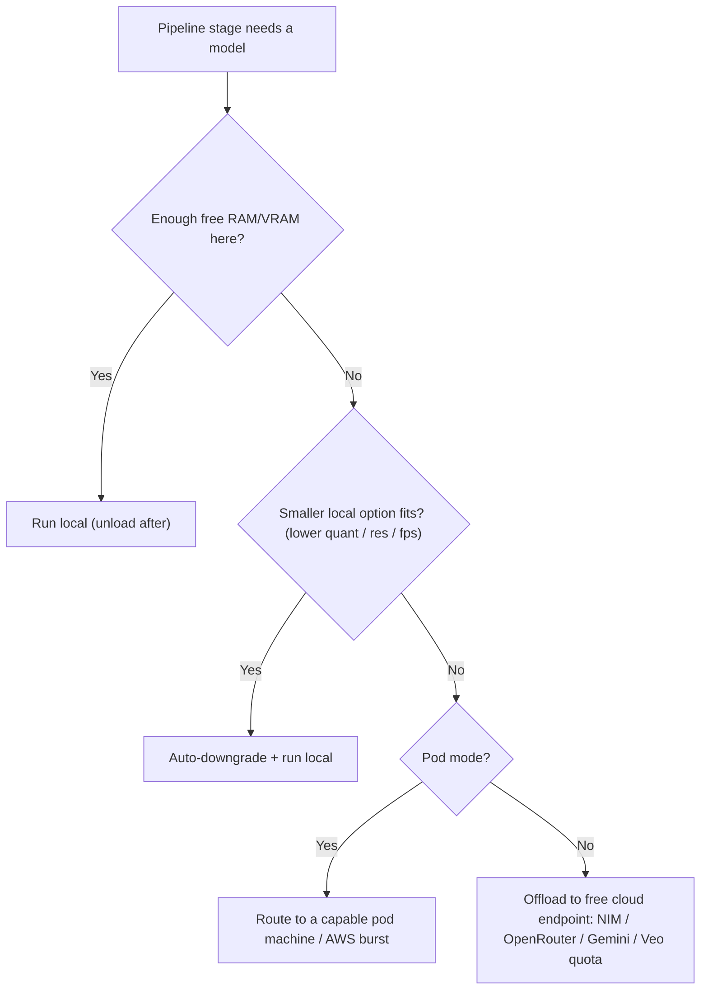
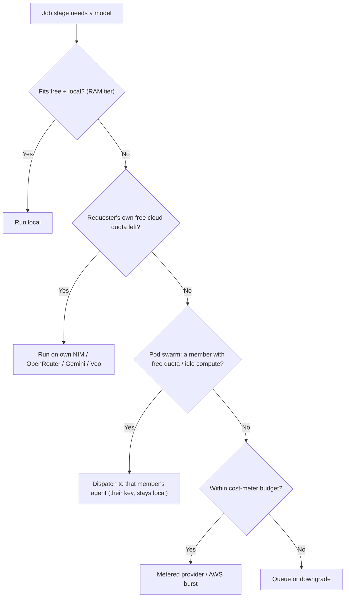
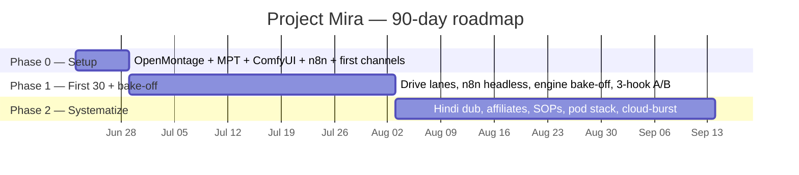

# Project Mira — AI Video Content Engine

**Goal:** A cheap, automated, *consistent* engine that produces high-quality short-form video (Instagram Reels + YouTube Shorts) in **English + Hindi**, across **multiple channels** (faceless + a personal brand), built to scale across collaborators and to monetize over time.

**The three pillars (your words):** Automation of topics · Quality · Consistency.

> This plan was produced by a 6-person virtual team: four senior engineers who read every repo line-by-line, plus an n8n automation architect and a creator-economy strategist who did live web research. It is grounded in the actual code on disk and cited 2026 sources — not vibes.

---

## 0. TL;DR — what to actually do

1. **Primary engine = OpenMontage** (AGPL, agentic, Cursor-driven). It's a full production platform, not a helper: **12 pipelines** (talking-head, cinematic, animated-explainer, clip-factory, character-animation, **localization-dub for Hindi**, etc.), a **provider selector** (`tts/image/video_selector`), a **cost tracker**, **checkpoint approval gates**, style playbooks, and enhancement tools (upscale/face-restore = your "enhance my photos/clips" ask). Its image + Remotion/HyperFrames composition path needs **no GPU** ($0.15–$1.33/video in its own examples). The dashboard's Engines matrix, cost meter, and approval gate are wired **directly** into its selector, `cost_log.json`, and checkpoint policies — `mira` just wraps them.
2. **Headless faceless-volume engine = MoneyPrinterTurbo** (MIT, 89k★, ships a web UI + API). n8n fires it for fully-automated faceless shorts where you're not in the loop. Kept **alongside** OpenMontage for now; a **quality bake-off** decides which one we eventually retire (OpenMontage is favored to win).
3. **Personal-brand path = film yourself + HyperFrames captions** (free), *or* AVTR-1 talking-head — but AVTR-1's renderer is **non-commercial licensed** (paid license needed) and Linux+NVIDIA only.
4. **Orchestration = self-hosted n8n** (~$5/mo Docker). Trigger → script → voice → visuals → assemble → caption → schedule.
5. **Posting:** YouTube Shorts via free Data API; Instagram needs a Business/Creator account + Graph API (or Blotato $29/mo, native n8n node).
6. **Language money lever:** **script in English first** (3–5× higher RPM), use **YouTube free auto-dubbing → Hindi** for long-form, and run a **separate native Hindi Shorts account** for reach + Indian brand deals.
7. **Budget:** ~**$35–70/month per channel**, ~$10–30 marginal per extra channel.
8. **Out of the pipeline:** `Free-ai-video-generator` (no real code). `locally-uncensored` is reframed as an optional **local cockpit/sandbox** (redundant front-end, no API — not a pipeline node). `StoryGen-Atelier` is **promoted to the cinematic/story lane** (its Veo interpolation-chain runs on your quota). Don't build whole shorts from raw Veo.

---

## 1. The repos — forked, analyzed, scored

All 9 are **cloned** to `repos/` and **forked** to your personal GitHub (`github.com/rkz91/*`). Local clones are wired with `origin` = your fork, `upstream` = original.

| Repo | Role | License | Cost fit | Verdict | Deep dive |
|---|---|---|---|---|---|
| **OpenMontage** | **Primary engine**: 12 agentic pipelines (talking-head, cinematic, explainer, clip-factory, Hindi localization-dub), provider selector, cost tracker, checkpoint gates, style playbooks, enhancement + talking-head tools | AGPL-3.0 ⚠️ | Excellent — $0.15–$1.33/video, no-GPU Remotion/HyperFrames path | **KEEP — primary engine** | [analysis](f78fc4e8-6dfd-47db-bf02-dd57b04c1cfa) |
| **MoneyPrinterTurbo** | Headless faceless-volume engine (web UI + API) for n8n-fired auto-shorts | MIT ✅ | Excellent (free TTS, swappable LLM) | **KEEP — headless volume (bake-off vs OpenMontage)** | [analysis](cdabc08c-da34-4cc4-b848-5199f2fbefd3) |
| **HyperFrames** | Composition runtime inside OpenMontage (kinetic typography, motion graphics, rigged SVG character animation) + your-clip compositing | Apache-2.0 ✅ | Free locally | **KEEP (OpenMontage runtime)** | [analysis](8c103821-455b-4fc7-b045-6b7e6362f425) |
| **SkyReels-V2** | Self-hosted open video model on the **AWS cloud-burst** path: 14B for long/coherent quality clips, 1.3B for fast drafts | Skywork (commercial OK) ⚠️ | Metered cloud GPU, burst-only | **KEEP — cloud-burst fallback** | [analysis](dce6530f-4b24-4785-a111-379daa0b5059) |
| **Open-Generative-AI** | Premium AI lane front-end: **motion transfer (Kling Motion Control), lip-sync, AI clipping**, workflows | MIT ✅ | Metered (MuAPI ~$0.30–0.80/clip) | **KEEP — premium lane UI** | [analysis](cdabc08c-da34-4cc4-b848-5199f2fbefd3) · [re-audit](5e8fafad-5987-4557-94e4-5aa6297e1b39) |
| **StoryGen-Atelier** | **Cinematic/story lane**: storyboard → **interpolation-chain** (Veo keyframe A→B clips) → FFmpeg stitch; Gemini + Vertex Veo native, style presets (Ghibli/Anime/Cyberpunk/Realism) | Apache-2.0 ✅ | ~$0 within your Veo quota; quota-heavy (many clips/video) | **KEEP — cinematic/story lane (port chain into OpenMontage)** | [analysis](dce6530f-4b24-4785-a111-379daa0b5059) |
| **AVTR-1** | Talking-head lip-sync from a photo | renderer **non-commercial** ⚠️ | Needs Linux+NVIDIA + paid license | **MAYBE (personal brand only)** | [analysis](8c103821-455b-4fc7-b045-6b7e6362f425) |
| **locally-uncensored** | Optional **local cockpit/sandbox**: uncensored chat + image/video studio + coding agent + phone-remote; wraps Ollama/ComfyUI/LM Studio (no clean API for the pipeline) | AGPL-3.0 ⚠️ | Free local | **OPTIONAL — cockpit, not a pipeline node** | [analysis](8c103821-455b-4fc7-b045-6b7e6362f425) |
| **Free-ai-video-generator** | (README-only; no pipeline code) | MIT | — | **SKIP** | [analysis](cdabc08c-da34-4cc4-b848-5199f2fbefd3) |

**License flags you must respect:**
- **AVTR-1 renderer = PolyForm Noncommercial.** A monetized channel is commercial use → you need an Avaturn commercial license or their hosted API. Don't build the personal-brand pipeline on it until that's sorted.
- **OpenMontage / locally-uncensored = AGPL-3.0.** Fine to *use* to make videos. The copyleft only triggers if you **distribute the modified software** or run it as a network service for others. Don't ship a hosted modified editor without sharing source.
- **SkyReels = Skywork Community License.** Commercial use allowed, with China-origin compliance terms — read the PDF before relying on it commercially.

**How the repos fit together:**

---

## 2. The Engine (recommended architecture)

**Two engines, routed per channel.** OpenMontage is the **primary, in-the-loop engine** you drive from Cursor + the dashboard (it owns provider routing, cost tracking, and approval gates). MoneyPrinterTurbo is the **headless engine** n8n fires for fully-automated faceless volume where you're not reviewing each one. A channel's *trust level* picks the engine: "Always review" → OpenMontage; "Auto-publish when trusted" faceless → MoneyPrinterTurbo. We run both until a quality bake-off (Phase 1) tells us which to keep.

**Production lanes (mostly OpenMontage pipelines):**

- **Lane A — Faceless:** OpenMontage `animated-explainer` / `animation` / `cinematic` (designed typography + motion graphics via Remotion/HyperFrames, no GPU) for in-the-loop quality; MoneyPrinterTurbo (stock + TTS + captions) for headless auto-volume.
- **Lane A2 — Cinematic / story (hero pieces):** the **StoryGen-Atelier interpolation-chain** — storyboard → Gemini frames → **Veo keyframe A→B clips** → FFmpeg stitch, with style presets (Ghibli/Anime/Cyberpunk/Realism). Runs on your **Veo quota** (~$0 cash) but is quota-heavy, so it's for occasional narrative hero videos, gated behind the cost meter. Port the chain into OpenMontage's `cinematic` pipeline.
- **Lane B — Personal brand:** record a phone clip (or upload clips/photos) → OpenMontage `talking-head` / `clip-factory` cuts into shorts, removes silences, auto-reframes 9:16, burns captions; `enhancement` tools (upscale, face-restore, color-grade) clean up your footage. **Filming yourself is the default — zero GPU.** `avatar-spokesperson` (SadTalker/Wav2Lip talking-head-from-photo) is the open avatar path; AVTR-1 deferred.
- **Lane C — Premium AI (motion transfer + lip-sync, metered):** character image + reference motion video → **Open-Generative-AI → Kling Motion Control V2V** (Viggle-style), optional lip-sync. MuAPI credits, behind the cost meter. Guardrail: own/consenting/original characters + licensed music — cloning a real creator's likeness/dance risks the ELVIS/NO FAKES Acts and demonetization. Free fallback: Wan2.2-Animate GGUF on Mac (slow); Viggle free tier for ideation.
- **Lane D — Hindi:** OpenMontage `localization-dub` is a first-class transcript → translate → dub → optional lip-sync pipeline. One English source spins out a timed Hindi variant.

**Repurposing multiplier:** one long script/video → OpenMontage `clip-factory` extracts 4–10 vertical clips → each re-voiced EN + HI → cross-posted to Shorts + Reels. This is how you hit "consistency" without 7× the work.

---

## 3. Cheapest viable stack (per stage, with $)

| Stage | Pick | Cost | Notes |
|---|---|---|---|
| **Orchestration** | n8n self-hosted (Docker) | ~$5/mo VPS | Cloud's 2,500-exec cap breaks under polling. Use your AWS credits. |
| **Script LLM** | LM Studio local (MLX, M4 Max) → **NVIDIA NIM** free (MiniMax-M3, Nemotron 3, GLM/Kimi/DeepSeek/GPT-OSS, **Sarvam-M** for Hindi) → **OpenRouter** / **Mistral La Plateforme** (~1B tok/mo) / **Groq** / **Cerebras** / **Cloudflare Workers AI** / **GitHub Models** (free overflow) / HuggingFace local → Gemini free tier | $0 | All OpenAI-compatible: point `openai_base_url` at LM Studio (`localhost:1234/v1`), NIM (`integrate.api.nvidia.com/v1`), OpenRouter (`openrouter.ai/api/v1`), Mistral (`api.mistral.ai/v1`), Groq (`api.groq.com/openai/v1`), Cerebras (`api.cerebras.ai/v1`). The full free-tier pool (curated from `cheahjs/free-llm-api-resources`, accessed 2026-06-19) is free overflow + per-member swarm capacity; keep LM Studio local as the private default. |
| **Uncensored / edgy-creative (local)** | Abliterated/uncensored GGUF in **LM Studio** (script) + uncensored SDXL/Flux checkpoint in **ComfyUI** (image) | $0 local | The real value `locally-uncensored` pointed at: **no refusals on legitimately edgy-but-legal creative** (horror, satire, mature themes cloud models reject). Same `localhost` API we already route through, so it's a selectable provider — no extra app. Borrow the repo's curated model list + no-refusal system prompts. **Uncensored ≠ permission to post policy-violating content**; platform content-policy + AI-disclosure still enforced at the publish gate. |
| **TTS — English** | edge-tts (free) or local Kokoro | $0 | Built into MoneyPrinterTurbo + HyperFrames. |
| **TTS — Hindi** | **Sarvam Bulbul** (best Indian-language/code-mix) | ~$0.02–0.05/video | Beats ElevenLabs on Hindi in blind tests; edge-tts `hi-IN-SwaraNeural` is the free fallback. |
| **Visuals — base** | Pexels + Pixabay (free API keys) | $0 | |
| **Visuals — images** | local SDXL/Flux on Mac · Imagen-Fast / Gemini · **NIM image NIMs (FLUX.1/.2, SD3.5, Qwen-Image)** | $0 local / ~$0.02/img | NIM also hosts image models (some free endpoint, some self-host on GPU). Qwen-Image is strong at in-image text. |
| **Visuals — AI clips** | Veo 3.1 on Vertex quota (hero) + ComfyUI on Mac (LTX-Video, everyday volume); **Seedance 2.0 Mini** as a cheap metered draft/insert tier; **cloud-burst (Vultr free-credit GPU first, then AWS) → SkyReels-V2 14B / Wan** for self-hosted long/coherent clips | $0 within quota / $0 local / ~cheap metered / burst (free Vultr credit, then metered) | Mac-first. Cloud-burst only when the Mac is saturated/unusable or a job needs CUDA-only/heavier models — shows a cost warning and **auto-returns to local** when load drops. Seedance Mini (OpenMontage `seedance_*`) is for B-roll/inserts. Don't build whole shorts from Veo. |
| **Motion transfer / lip-sync** | Open-Generative-AI → **Kling 3 Turbo** Motion Control V2V (+ lip-sync, AI clipping) | ~cheaper than 3.0 (MuAPI), metered | Viggle-style character animation; Turbo tier lowers per-clip cost at near-3.0 quality with better lip-sync. Local Wan2.2-Animate GGUF on Mac = slow free fallback; Viggle free tier for ideation. |
| **Composition + routing** | OpenMontage (Remotion / HyperFrames / FFmpeg runtimes; `tts/image/video_selector` for provider routing) | $0 local | The dashboard Engines matrix reads `provider_menu()`; cost meter reads `cost_log.json`; approval gate = checkpoint policy. `mira` wraps these. |
| **Captions** | faster-whisper (local) + word-burn (Remotion/FFmpeg) | $0 | Hindi via `language: "hi"`. Add **Noto Sans Devanagari** font. Built into OpenMontage (`transcriber` + `subtitle_gen` + `remotion_caption_burn`). |
| **Music / audio** | Pixabay Music + Freesound (free) / local `music_gen` → optional **Suno** for custom beds | $0 / cheap metered | **Royalty-free is mandatory for monetization** — never lift copyrighted tracks. OpenMontage `pixabay_music` / `freesound_music` / `music_gen` / `suno_music`; auto-ducks under VO. Per-channel default bed lives in the brand kit. |
| **Thumbnail + metadata (SEO/CTR)** | image model (Imagen-Fast / Flux / Qwen-Image for in-image text) for thumbnail + LLM for title/description/tags/hashtags | $0 local / ~$0.02/img | **Critical for long-form YouTube CTR and Shorts discovery — was the biggest gap.** Generate 2–3 thumbnail options + title variants per video; pick in Review. OpenMontage image lane + script LLM; localize for Hindi. |
| **Posting — YouTube** | YouTube Data API | Free (100 units/upload, ~40–100/day per GCP project) | One project per channel. |
| **Posting — Instagram** | Graph API (Business/Creator acct) or **Blotato** | $0 / **$29 flat** | Blotato has a native n8n node, covers IG + 8 platforms, ~20 accounts. |

> **Compute model — Mac first, cloud on demand.** Your M4 Max (64 GB) runs scripts, voice, images, editing, captions, and local AI video (ComfyUI/LTX) for free. **Cloud-burst GPU (Vultr free credits first, then AWS) is a deliberate fallback, not an everyday requirement:** it spins up only when the Mac is saturated or unusable, or a job needs a CUDA-only/heavier model (SkyReels-V2 14B, Wan 14B, longer/high-res clips). Bursting shows a **cost warning + live meter** (and tracks remaining free Vultr credit), and the system **auto-returns to local and tears down the GPU as soon as load drops**, so you're never billed for an idle instance. Otherwise spend AWS/GCP credits on infra (n8n host, media storage/CDN), not generation.

>
> **Your assets, clarified:** Veo's hero clips run through the **Vertex API** path on your quota (the Gemini Pro app quota is app-only and can't be automated). **NVIDIA NIM is a bigger free lever than first scoped:** an OpenAI-compatible endpoint (`integrate.api.nvidia.com/v1`, `nvapi-` key) serving **MiniMax-M3** (428B multimodal VLM — reads screenshots/reference videos and reasons, great for scripting and "analyze a video you love"), **Nemotron 3**, GLM/Kimi/DeepSeek/GPT-OSS, and **Sarvam-M** for Hindi, plus image NIMs (FLUX/SD3.5/Qwen-Image). It's the free overflow LLM/image endpoint and the way a collaborator without a strong Mac plugs in. Caveat: rate-limited dev/trial tier (~40 req/min), and MiniMax-M3 is non-commercial licensed — fine for this hobby phase, flag at monetization. **On video generation**, NIM's hosted video models are NVIDIA **Cosmos** (physics/world-model, synthetic-data oriented), not creator short-form — so your video lanes stay **Veo on Vertex quota + local ComfyUI/Wan on the Mac**. **Kiro and Cloud9 are IDEs** (build-time tools, like Cursor), not runtime inference or GPU sources, so they sit in the workshop, not the engine. **Midjourney is optional and not required** — local SDXL/Flux, Imagen, and NIM image NIMs cover stills and thumbnails; revisit only if you want a specific MJ aesthetic.
>
> **Your own photos & clips (the personal-brand asset loop):** anything you shoot or upload lives in a reusable **Assets library**. On ingest, OpenMontage enhances it — `upscale` / `face_restore` / `color_grade` / denoise / stabilize — and a still photo can be **animated into short motion B-roll** (image-to-video via LTX on Mac or Veo on quota). Enhanced assets become first-class B-roll any lane can pull, so your face/footage threads through faceless and personal channels alike.

**Per-channel monthly estimate:** **$0–30**, now that compute is Mac-local and AI clips use existing quota. The only recurring costs are optional: Sarvam Hindi voice (~$0.02–0.05/video) and Blotato ($29 flat) for Instagram posting. Marginal cost per extra channel: near $0.

> **Metered video models — watch-list (adopt via the selector, don't hard-bake).** The "mini/turbo" wave is making cheap AI video viable. Adoption rule: the moment a model exposes an API, it becomes a selectable provider in OpenMontage's `video_selector`, routed behind the cost meter, tagged draft vs hero. Currently tracking: **Kling 3 Turbo** (in use, motion transfer), **Seedance 2.0 Mini** (cheap draft, in use; 2.5 rumored), **Maine Coon / Catnip AI** (9:16 vertical, fast — but H100/cloud, not Mac), **Alibaba Happy Oyster** (real-time world model, not short-form yet), **Google "Nano Banana / Instant Ramen"** (image model, would join the images row on API release). None change the Mac-first/free-first core; they're cheap metered upgrades.

### 3.1 Cost intelligence — a learning estimator
The cost meter doesn't just tally; it predicts before you spend and sharpens over time.
- **Predict:** before generating, decompose the job into billable units (N sec Veo, M images, K chars Sarvam, 1 Kling-Turbo clip) and price with learned unit costs. Studio shows this per lane before you commit.
- **Reconcile:** OpenMontage's `cost_tracker` already logs estimate → actual per run in `cost_log.json`. We add a `cost_model.json` of rolling unit costs ($/sec Veo, $/clip Kling, $/1k chars Sarvam, $/image incl. thumbnails, $/Suno track), updated by an exponential moving average after each run.
- **Learn:** each run tightens the estimate — the preview shows a range ("≈ $0.42, ±15%, from your last 9 runs") that narrows as samples accumulate. The same model learns render **time** → ETAs.
- **Forecast:** the budget meter projects "at this pace you'll hit your $50 cap in ~11 days" and warns before a metered lane blows the cap.
- Command: `mira estimate <job-spec>`; the same learned numbers feed the `mira engines` cost hints and the Studio per-lane preview.

Full sourced breakdowns: [n8n/stack research](2e9f8388-8c53-4c07-8239-cab1e160a50e) · [creator strategy](c6b4a9cf-938f-47c4-aaf8-1d9e48407b0f).

---

## 4. Strategy — niches, language, consistency, quality

### 4.1 Niche (where high RPM meets low saturation)
- **English revenue channel:** AI-tools-for-creators **or** business case studies / SaaS reviews — Tier-1 RPM ($13–$38) **and** low saturation, and it's adjacent to your day-job expertise.
- **Hindi growth channel:** curiosity / "did you know" Shorts — huge reach + Indian brand deals (per-view pay is tiny, brand deals are not).
- **Avoid:** sleep music, ASMR, scary-story narration, generic compilations ($0.50–$4 RPM, brutal saturation — and now the named target of YouTube's "inauthentic content" enforcement).

### 4.2 Language = your biggest money lever
- English ≈ **$5.6 RPM** vs Hindi ≈ **$0.26 RPM** for the same content. **Script English first.**
- **Long-form:** one English channel + YouTube **free auto-dubbing to Hindi** (now "Expressive Speech," review-on). Doesn't hurt original discovery.
- **Shorts/Reels:** separate **language-native accounts** (mixing languages confuses short-form distribution). Re-voice the same visual EN + HI.

### 4.3 Consistency engine (the real growth driver)
- **Start 3–5 Shorts/week**, scale to **1/day** after the format works (daily ≈ 2.8× the views of 3×/week). Don't jump to 2/day until 60 clean days at 1/day.
- **Batch weekly, schedule daily.** One 2–4 hr Monday session = next week's 7 shorts. Keep a **5–7 day buffer**.
- Algorithm needs ~30–40 videos to learn you; baseline lifts after 200+.
- **Per-channel brand kit (visual consistency = recognizability):** each channel locks a kit — intro/outro stings, logo/watermark placement, caption font + style + color, palette, default music bed, title-card template. Every render inherits it automatically so the channel looks the same on video #5 and #500. Stored on the channel, applied by OpenMontage at composition.

### 4.4 Quality bar — the 90-second pre-publish gate (run on *every* video)
- [ ] First visual change < ~1.2s; hook claim delivered by 3s; works **sound-off**.
- [ ] Payoff/reveal before the 60% mark; a visual/audio shift every 2–5s; silences > 0.25s cut.
- [ ] Captions large, high-contrast, word-synced, inside safe zones; **no competitor watermarks, no letterbox bars**.
- [ ] Natural voice (not robotic).
- [ ] **Packaging:** thumbnail + title selected (long-form: 2 thumbnail options for A/B); description/tags/hashtags generated and localized for the channel language.
- [ ] **AI disclosure** toggled where realistic synthetic media is used.
- [ ] **Human gate:** Is it accurate? A complete point? Would an expert stand behind it? Does it help the viewer? Only publish if yes.

### 4.5 Length & pacing — the duration control (very important)
- **Two video types, set per channel:**
  - **Short-form (9:16):** default **30–45s**; 15s and 30s are fine; YouTube Shorts up to **60s**; **75–90s only rarely**. Reels cap 90s.
  - **Long-form (16:9, YouTube):** target **3–5 minutes** (the main YouTube goal).
- **Completion/retention beats absolute length** at both scales.
- **How we control it (deterministic, not hope):**
  1. Each channel stores a **video type + target band + hard cap**.
  2. Script stage converts the band into a **word budget** (EN ≈ 2.7 words/sec, HI ≈ 2.3): 30s ≈ ~80 words, 60s ≈ ~160, **3 min ≈ ~480, 5 min ≈ ~800** — and writes to it.
  3. TTS runs at a fixed speaking rate, so words → seconds is predictable.
  4. Compose validates **final duration via ffprobe** against the band; `silence_cutter` trims dead air; over cap → auto-tighten or flag in Review.
- Built on OpenMontage's `media_profiles` (9:16 shorts + `youtube_landscape` 16:9), `verify_scene_pacing.py`, `silence_cutter`, and compose success-criteria. Type/length is set on the **Channel**, overridable per video in **Studio**; the QA gate checks final duration is in-band.

### 4.6 Hitting 3–5 minutes on YouTube (the long-form method)
A 3–5 min video is a different build than a Short — more script, more scenes, real retention scaffolding. Use OpenMontage's longer pipelines (`animated-explainer`, `documentary-montage`, `cinematic`):
1. **Research → script (480–800 words)** structured for retention: hook in the first 15s, an open loop, 3–6 body beats, payoff, CTA (explainer's research stage grounds the facts).
2. **Scene plan = many scenes**, a visual change every ~3–8s to avoid dead air. Keep it cheap: free **stock** (Pexels/Pixabay) + **designed graphics/animated images** via Remotion/HyperFrames + **occasional hero AI clips** (Veo-quota / Seedance) only at key moments. Never AI-generate the whole runtime.
3. **Narration stays free:** Google TTS (1M chars/mo) or edge-tts covers minutes at $0; Sarvam for Hindi. ElevenLabs is too costly at length.
4. **Assemble at 16:9 1080p** with **chapters/timestamps**, music bed, word-synced captions; the QA gate adds long-form checks (intro <15s, visual cadence, no dead spots, payoff pacing).
5. **Package for click-through (the #1 long-form lever):** generate 2–3 **thumbnails** + title variants (readable at small size, face/emotion or bold text) plus description/tags/chapters; pick the winner in Review. A strong video with a weak thumbnail/title still dies. (`mira package`.)
6. **Hindi:** YouTube auto-dub (review-on) or the `localization-dub` pipeline.
7. **Repurpose (the multiplier):** the long-form is the **hub** — `clip-factory` slices it into 4–10 vertical Shorts, each re-captioned/re-voiced, feeding your Shorts/Reels channels. Make long-form once, harvest a week of Shorts.
- Cost: mostly **$0** (stock + local compose + free TTS) within your Veo quota; the learning estimator predicts each long-form's metered spend before you commit.

---

## 5. Monetization & realistic timeline

- **YPP:** 1,000 subs + 4,000 watch hrs (12 mo) **OR** 10M Shorts views (90 days). You can qualify on Shorts alone, then manually accept the Shorts module (plus a policy review).
- **Shorts ad RPM is tiny (~$0.03–0.08/1k).** Shorts = growth/subs. Real money = long-form ads + **affiliates + brand deals + digital products from day 1**.
- **Instagram:** Reels Play Bonus is dead for new creators → income = brand deals + affiliates + Gifts/subs.
- **Exit value:** faceless channels sell at **24–36× monthly profit** (vs 12–24× for personality channels). Document SOPs from day 1.

| Timeline | Expectation (high-RPM English niche, 3–5/wk) |
|---|---|
| Months 1–3 | $0; build 30+ videos; algorithm learning; first affiliate trickle |
| Months 3–6 | Near/at YPP; **$0–$100/mo** |
| Months 6–12 | **$200–$800/mo** as affiliates + first sponsorships kick in |
| 18–30 mo | **$3,000+/mo** for those who never stopped publishing |

*(Hindi-majority audience: add ~4–8 months to each milestone — the RPM tax, and why English leads.)*

---

## 6. Collaboration model (consistency as a moat)

Faceless = perfect for a shared engine (no key-person risk).
- **Central engine:** shared research DB, script templates, voice library, B-roll/asset library, brand/caption templates, one scheduler.
- **Rotate roles** across a pod (research/scripts → VO/edit → schedule/community) so a solo 1/day becomes a 4-channel/day pod at the same per-person effort.
- **Cross-posting network:** collaborators stitch/duet/share each other's clips (shares > likes for Shorts ranking).
- **SOPs = exit value:** the engine naturally produces SOPs → each channel becomes independently sellable.

### 6.1 Distribution & multi-user (local-first, cloud-coordinated)
This is a hobby app you'll **hand to friends** — each runs it on their own Mac (or Windows) with their own keys. Because the engine is inherently local (OpenMontage, ComfyUI, LM Studio, ffmpeg renders need a real machine — not Vercel's ~60s serverless functions or Supabase's Postgres), the design splits into **two planes**:

- **Execution plane — local, per person, required.** A **Mira Agent** each person installs: the `mira` FastAPI + OpenMontage + ComfyUI/LM Studio + ffmpeg. Their keys live only in their **own local `.env`** — never uploaded. Their compute does their work. This keeps the local-first / nothing-at-risk principle intact even with a pod.
- **Coordination plane — cloud, optional, shared.** **Frontend on Vercel** (free tier: the Next.js dashboard). **Supabase** (free tier: Postgres + Auth + Storage + Realtime) holds only **shared coordination state** — users, channel registry, collaborator roles/assignments, idea inbox, topic queue, schedule, video metadata + status, analytics rollups, audit + cost rollups. **No secrets, no source media, no rendering in the cloud.** Realtime keeps everyone's *Today* live.

**How they connect (securely, no tunnels):** each Mira Agent **pulls the jobs assigned to its owner** from Supabase, runs them on that owner's machine/keys, and reports back metadata + a lightweight preview (full-res media stays local or goes to that person's own storage/YouTube). The UI never reaches into anyone else's machine.

**Two run modes:**
- **Solo / local (default, prototype):** UI talks straight to `localhost` (the agent). No cloud, no Supabase. This is Phases 0–1.
- **Pod / shared (friends):** Vercel UI ↔ Supabase (shared state + realtime) ↔ each friend's local agent. Generation is distributed across each person's own Mac/Windows.

**Cross-platform (Mac-first, Windows-capable):** engine is Python + Node + ffmpeg → runs on both. Mac = MLX/Metal (LM Studio + LTX ComfyUI). Windows = CUDA ComfyUI or, with no GPU, lean on **NIM / OpenRouter / Gemini free + Veo quota** (the same "weak-laptop collaborator plugs in via cloud endpoints" path from §6). Distribute via a one-command setup (`mira setup`) or a small **Tauri/Electron tray app** that bootstraps deps and launches the onboarding wizard.

**Onboarding a friend:** open the Vercel URL → create a Supabase account → join the pod by invite → install the Mira Agent → run onboarding to add **their own** keys + detect their LM Studio/ComfyUI → pair the agent to the pod with a code → they're live on their own machine.

### 6.2 Hardware tiers & RAM management (so it runs on any laptop)
Your M4 Max (64 GB) is the heavy node; friends may be on 16 GB or 8 GB, Mac or Windows, GPU or none. Principle: **the same job always completes — the agent routes each stage to what the machine can handle and offloads the rest to free cloud endpoints or a stronger pod machine, instead of OOM-crashing.**

**1. Detect & tier at onboarding.** The Mira Agent probes RAM/VRAM/OS/GPU (extends OpenMontage `support_envelope()`) and assigns a tier that sets Engines defaults:

| Tier | Machine | Local LLM | Local image/video | Default routing |
|---|---|---|---|---|
| **Heavy** | ≥48 GB (M-Max) or 24 GB+ GPU | up to 30–70B (quant) | SDXL/Flux + LTX local | full local stack |
| **Mid** | 16–32 GB, modest/no big GPU | 7–8B Q4 local | SDXL only, low-VRAM; no big video | small local LLM + cloud for video |
| **Light** | ≤16/8 GB or no GPU | none (or 3B) | none | all generation via NIM/OpenRouter/Gemini + Veo quota; only compose/captions local |

**2. Graceful degradation, not crashes.** Each tier just shifts providers in the Engines matrix; the lightweight compose (Remotion/FFmpeg) stays local everywhere, so even a Light machine creates videos.

**3. Run lean on-box.** Stages run **sequentially with model unloading** between them (never hold LLM + ComfyUI + Remotion in RAM at once); ComfyUI uses `--lowvram`/tiled VAE, GGUF picks a quant that fits (Q4_K_M default, smaller on tight RAM), faster-whisper scales its model size to RAM, and long-form renders in **segments** to bound peak memory. Concurrency is capped to **1** on Mid/Light.

**4. RAM-headroom guardrail.** The agent watches free RAM and, before a stage would breach a safe headroom (keep the OS ~3–4 GB), **auto-downgrades** (smaller quant/model, lower res/fps) or **offloads** that stage — it never thrashes into an OOM.

**5. Pod offload (the multiplier).** In pod mode each job carries capability requirements; the scheduler routes a heavy job from a weak laptop to a **capable pod machine (your Mac) or AWS cloud-burst**, with results synced back via Supabase.

### 6.3 Compute swarm — pool the pod's accounts (capacity-aware routing)
Instead of each laptop fighting its own RAM/quota limits, the pod **swarms**: every member brings their own free accounts (NIM, OpenRouter, **Mistral La Plateforme, Groq, Cerebras, Cloudflare Workers AI, GitHub Models**, Gemini/Vertex-Veo, optionally their own AWS), and a **quota-aware router** spreads work across whoever has headroom — maximizing premium-model access and burst compute without any one account hitting its cap.

**Free Script-LLM provider pool (curated from [`cheahjs/free-llm-api-resources`](https://github.com/cheahjs/free-llm-api-resources), accessed 2026-06-19).** These are all OpenAI-compatible perpetual free tiers the router pools per member — the most valuable headroom multiplier in the swarm:

| Provider | Free allowance (approx.) | Best for |
|---|---|---|
| **Mistral (La Plateforme)** | ~1B tokens/mo, 500k tok/min | Bulk scripting — the largest free pool |
| **Groq** | ~14.4k req/day (Llama 8B) | Fast — headless/volume lane |
| **Cerebras** | ~14.4k req/day, gpt-oss-120b | Fast high-quality drafts |
| **Cloudflare Workers AI** | 10k neurons/day | Easy free overflow (Llama/Qwen/GLM) |
| **GitHub Models** | Copilot-tier (gpt-5/o3/DeepSeek) | Frontier planning/QA, tight token caps |

LM Studio local stays the private default; these are *overflow*, not primary (rate-limited, availability shifts). ToS note: free dev tiers are for genuine per-user use — one real account per member, fine at hobby scale, switch to paid keys at monetization.

**Core principle — pool capacity, not keys.** The scheduler routes the *job* to the member whose account/machine has free quota; **their** local agent runs it on **their** own local key and returns the result. Keys never leave their owner's machine; Supabase tracks only *available capacity*, never secrets. This is the secure generalization of §6.1's "pod offload."

**Router policy (per job stage):**

**Quota ledger.** A live per-account ledger (req/min used, daily caps, Veo clips left, AWS budget left) drives routing and a pod capacity view. Auto-rotation (least-used-first + 429-backoff) maximizes premium-model throughput (MiniMax-M3, larger OpenRouter models) far above any single account's ~40 req/min limit, with automatic failover.

**Cloud-burst providers, honestly.** The best free GPU lever for the pod is **Vultr**: new accounts get **$250–$300 credit that *does* cover Cloud GPU** (A100 ~$1.35/hr → ~185 GPU-hours; A40/GH200 too) — unlike **AWS**, whose free tier *excludes* GPU. So **Vultr is the preferred first burst target, AWS/others the fallback**, and per-member accounts pooled give the swarm serious free GPU for SkyReels-14B/Wan/ComfyUI. Caveats: the credit **expires (commonly 30 days; some promos 90/365 — verify at signup)** and is use-it-or-lose-it, a card is required, and you must **destroy instances to stop billing** (our auto-teardown handles this). Stacking credits via many accounts per person is a ToS gray area — one genuine account per real member, fine at hobby scale, revisit at monetization. The genuinely *perpetual* free levers stay NIM/OpenRouter/Gemini/Veo-quota — which the router still maximizes first.

**Watch-list — free-GPU sources, honestly (none on the automated critical path):**
- **[`RohanAdwankar/cgpu`](https://github.com/RohanAdwankar/cgpu)** — a CLI exposing a free cloud GPU in-terminal (`cgpu run <cmd>`, keeps FS state). If it matures, it could slot into the router as a **free-GPU tier before paid burst** for light CUDA jobs. Off the critical path: built for *learning CUDA*, free source unnamed (likely small/ephemeral, ToS-limited — not viable for SkyReels-14B/LTX-minutes), early solo project; its `cgpu serve` Gemini proxy is redundant.
- **Kaggle (free, best of the notebook tier)** — ~**30 GPU-hrs/week**, a **dedicated** P100 (16GB) or 2×T4, background-capable notebooks. The strongest free option for a **manual sandbox**: hand-run SDXL/ComfyUI batches → drop into the **Assets library**. Caps: 9h consecutive, notebook-only.
- **Google Colab (free, T4 16GB)** — same idea, weaker: shared GPU, 12h cap, 30-min idle stop. Manual sandbox only.
- **Others (notebook-bound, manual only):** SageMaker Studio Lab (free T4, no card, but 4h/run · 8h/day), Paperspace Gradient (5GB storage, public notebooks), Codesphere (not notebook-locked + background exec, but shared GPU + supply-constrained). Google Cloud's $300 = the same credit lever as our Vertex/Veo.

Rule: **every free GPU here is a notebook/interactive platform — manual/experimental only (their ToS forbids headless serving; T4/P100 won't hold the 14B video models). The automated pipeline bursts to Vultr (free credit) → AWS, and always falls back to local on failure.** (Source list dated Nov 2023 — verify current terms.)

**Guardrails (honest):**
- **ToS:** free dev tiers are for genuine per-user development. Routing each member's *own* jobs to *their own* quota is defensible; mass-minting accounts to evade limits for high volume is against ToS and risks bans — fine at hobby scale, **switch to paid keys before monetization.**
- **Fairness:** the ledger tracks each member's contributed compute so load stays equitable.
- **Trust/privacy:** a swarmed job runs on a teammate's machine (fine in a trusted pod); personal-footage jobs can be pinned **local-only**.
- **Reliability:** timeouts, retries, offline-agent handling; no pod capacity → fall back to metered/burst or queue.

**Phased rollout:**
- **A (now, solo):** single-account fallback chain already in the selector (NIM 429 → next provider).
- **B (pod forms):** quota ledger + multi-account rotation across the pod; "auto-route across pod accounts" toggle on Engines; pod capacity view.
- **C (scale):** fairness accounting, AWS-burst volunteering, monetization-time switch to paid keys.

**Depends on:** pod scheduler (§6.1), RAM tiers (§6.2), cloud-burst (§3), cost intelligence (§3.1). **Adds:** a quota ledger in Supabase + a router in the `mira` command layer. **Success criteria:** a Light-tier laptop can complete any job via the swarm; premium throughput exceeds any single account's cap; no account gets rate-limit-banned; spend stays within the pod budget cap.

---

## 7. Risk & staying monetizable (2026 rules)

- **YouTube "inauthentic content" (eff. Jul 15 2025):** bans mass-produced/templated content with little variation — and it judges the **whole channel**. Using AI is fine; **add original analysis/framing every video** and **vary structure**. Avoid slideshow-fact / recycled-narration formats (also the low-RPM traps).
- **AI disclosure (since May 2025):** disclose realistic synthetic media in Studio. This alone does **not** demonetize you.
- **Content policy applies to whatever tool you use** — uncensored or not, don't post IG/YouTube-violating content. The check lives at the **publish gate** and applies equally to every engine. **Correction on `locally-uncensored`:** the *capability* it represents — an uncensored local model that won't refuse legitimately edgy-but-legal creative (horror, satire, mature themes) — is **in the pipeline** as a selectable provider (abliterated GGUF in LM Studio + uncensored ComfyUI checkpoints, same clean `localhost` API). Only the *repo app* stays out, because it's a redundant wrapper over those same engines; we lift its curated model list + no-refusal prompts instead of running it.

---

## 8. 90-day roadmap

**Phase 0 — Setup (Week 1)**
1. Stand up **OpenMontage** (`make setup`: Python 3.10+, FFmpeg, Node for Remotion; `npx hyperframes doctor`). Add free Pexels/Pixabay keys; point its LLM at Cursor/you (no runtime LLM key); add **Noto Sans Devanagari** to fonts. Run the capability probe (`tool_registry.support_envelope()` / `provider_menu()`).
2. Also stand up **MoneyPrinterTurbo** (Python 3.11, web UI + API) for the headless lane; set `openai_base_url` → LM Studio (`localhost:1234/v1`).
3. Add **ComfyUI** (Mac/Metal, LTX-Video) and confirm **NVIDIA NIM** free endpoints as the overflow/collaborator LLM+image.
4. Spin up self-hosted n8n (Docker on AWS credits).
5. Pick niches: 1 English (AI-tools/business) + 1 Hindi (curiosity). Create the EN + HI Shorts accounts + 1 YouTube long-form channel.
6. Wire posting: YouTube Data API project per channel; decide Blotato ($29) vs IG Graph API for Reels.

**Phase 1 — First 30 videos + engine bake-off (Weeks 2–6)**
7. Drive OpenMontage from Cursor + the dashboard for in-the-loop lanes (talking-head, explainer, cinematic, Hindi `localization-dub`); checkpoints = your approval gate.
8. Build the n8n flow for the headless faceless lane: topic queue → script → VO → MoneyPrinterTurbo assemble → captions → QA gate → schedule.
9. **Engine bake-off:** produce the same faceless brief through both OpenMontage and MoneyPrinterTurbo; compare quality, cost, and effort; decide which to retire (default: keep OpenMontage).
10. Run the **3-hook A/B test** to find your default opener. Batch weekly, schedule daily (3–5/wk).

**Phase 2 — Systematize (Weeks 7–12)**
11. Turn on YouTube auto-dub (Hindi, review-on) for long-form; OpenMontage `localization-dub` for native Hindi Shorts.
12. Add affiliate links + one cheap digital product from the start.
13. Write SOPs; recruit 1–2 collaborators into the shared engine (NIM lets a weak-laptop collaborator plug in). **Stand up the pod stack when friends join:** deploy the dashboard to **Vercel**, add **Supabase** (Auth + shared coordination DB + Realtime), package the **Mira Agent** installer (Mac + Windows), and pair each friend's local agent to the pod — keys stay on their machine.
14. Wire the **cloud-burst** path: a spot-GPU launch script for SkyReels-V2 (14B quality / 1.3B fast) + Wan, gated by a cost warning and **auto-teardown when idle / load drops**; evaluate Open-Generative-AI/MuAPI for premium AI clips.

---

## 9. Open decisions for you
1. **Personal-brand face:** license AVTR-1 (commercial) vs simply film yourself + HyperFrames captions (free)? Recommend starting with filming yourself.
2. **Instagram posting:** Blotato $29/mo (fastest) vs DIY Graph API (free, more setup)?
3. **First English niche:** AI-tools-for-creators vs business case studies?
4. **Resolved:** `locally-uncensored` = its **capability is in the pipeline** as a selectable uncensored-local provider (abliterated GGUF in LM Studio + uncensored ComfyUI checkpoints) for edgy-but-legal creative; only the redundant repo *app* stays out (optional cockpit). `StoryGen-Atelier` = cinematic/story lane. Open follow-up: port StoryGen's interpolation-chain into OpenMontage now, or run it standalone for hero pieces first?
5. **Pod model:** recommended design is **each friend runs their own local Mira Agent + a shared Supabase coordination layer** (keys/compute/media stay local; only metadata syncs). Confirm this vs. the heavier alternative of one shared host doing remote generation (rejected: cost, security, no GPU on Vercel/Supabase).
6. **Windows support depth:** first-class (CUDA ComfyUI + LM Studio) or cloud-only fallback (NIM/OpenRouter/Veo) for non-Mac friends?

---

*Repos forked to `github.com/rkz91`. Local clones in `repos/`. Research artifacts and per-repo deep dives linked above.*

*Companion docs: [`DASHBOARD_SPEC.md`](DASHBOARD_SPEC.md) (UI, screen connections, state machine) · [`DEV_PLAN.md`](DEV_PLAN.md) (testable, gated build sequence).*
