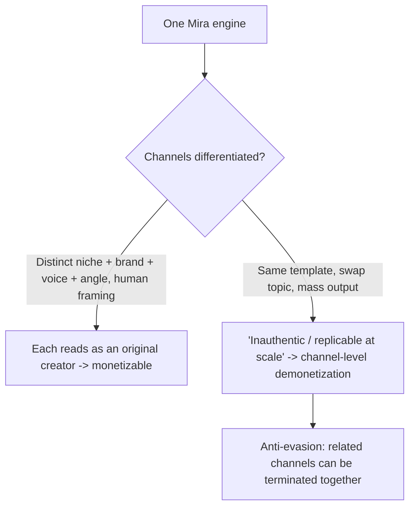

# Project Mira — Platform Policy & Monetization Compliance

The whole thesis is "build it cheap now, **monetize one day, pay everyone back**." That only works if the channels stay **eligible**. This doc is the compliance playbook: what YouTube and Instagram/Meta actually allow for AI content (2026), what gets you demonetized or terminated, and the rules Mira enforces so a fleet of AI channels survives.

> Companion to [`PLAN.md`](PLAN.md) (risk), [`DASHBOARD_SPEC.md`](DASHBOARD_SPEC.md) (Review gate), [`DEV_PLAN.md`](DEV_PLAN.md) (QA gate), [`SECURITY.md`](SECURITY.md), [`DECISIONS.md`](DECISIONS.md).
>
> Not legal advice — a working summary with sources. Re-verify before relying on any number.

---

## 0. Context that drives everything here
- **Markets:** US, Canada, India.
- **Language:** ~**95% English / 5% Hindi** (Hindi = occasional dub of top performers, not a primary channel).
- **Scale:** **many channels** — the app is shared across a pod, and each person may run **~5 channels**. So we could have **dozens of channels driven by one engine.** This is the single most important compliance fact in the whole project.

### Why "many channels off one engine" is the headline risk
YouTube's monetization policy literally targets *"content that's easily replicable at scale"* and *"mass-produced content using a similar or unoriginal template across multiple videos / channels."* Running N channels from the same Mira pipeline is **the exact pattern the policy was written to catch.** And the enforcement is brutal at the network level (see §1). **Differentiation per channel is not a nicety — it is the thing that keeps the lights on.**

---

## 1. YouTube

### AI is allowed and monetizable
YouTube is explicit: *"channels that use AI in their content remain eligible to monetize... AI usage alone does not violate monetization policies, provided creators follow disclosure requirements."* Faceless + AI is fine **if** it's original and varied.

### The rule that bites: "inauthentic content"
Renamed from "repetitious content" on **July 15, 2025** (a clarification, not a new rule — it was always ineligible). Ineligible content:
- Templated videos with **little to no variation** across uploads.
- **"Easily replicable at scale."**
- AI narration over stock-image slideshows with **no original insight**.
- Readings of material you didn't create (Wikipedia/Reddit/public-domain).
- Songs pitch/speed-shifted without transformative commentary.
- Narrative templates with only superficial swaps (same structure, new names).

### Enforcement is channel-level AND network-level
- *"If you have videos that violate our guidelines, monetization may be removed from your **entire channel**."*
- Anti-evasion: *"If any of your channels have been demonetized or terminated, you should **not create new (or use existing) channels** to get around these restrictions... Doing so could lead to **termination of all channels**."* → **For our many-channel fleet, one bad channel can endanger the rest if they're clearly related/templated.**

### Disclosure: mandatory, but free of penalty
- Must label realistic **altered/synthetic** content via Studio's "AI use" / "Altered or Synthetic" setting (e.g., a real person made to say something; a realistic scene that didn't occur; altered footage of a real event).
- *"Disclosing AI content won't limit a video's audience or impact its eligibility to earn money."* → **Default it ON; it costs nothing.**
- Consistent non-disclosure → YouTube labels it for you + possible removal / YPP suspension.

### Reused-content nuance (good for repurposing)
The "reused content" policy (commentary, clips, compilations, reactions) was **not** changed. Transformation with commentary/insight is fine — but raw re-cuts with minimal change are not.

### YPP thresholds (2026, per current guides — verify in-app)
- **Fan-funding tier:** ~500 subs + 3 public videos + **3,000 watch-hours or 3M Shorts views** (90 days).
- **Full ad revenue:** **1,000 subs + 4,000 watch-hours or 10M Shorts views** (90 days).

---

## 2. Instagram / Meta

### AI label = reach-neutral (officially)
- Opt-in **"AI Creator"** profile label (rolled out May 4 2026) + content-level **"AI info"** label. Meta: the label *"is designed to share this AI context neutrally... no impact on organic reach."*
- **But engagement still rules:** obviously-AI content that gets lower watch-time / sends / higher skips is demoted **on performance**, not on the label. Third-party reports of large reach drops on pure-AI posts exist (not official) → **human framing and quality matter.**

### The rule that bites: Original Content (active ~March–April 2026)
- Penalizes **aggregators / reposters** — re-uploading others' videos, TikTok-watermarked clips, screenshot carousels, thin reaction formats.
- **Account-level, graduated:** reduced distribution → loss of the **Content Monetization Program** → **non-recommendable** (invisible to non-followers).
- Threshold: **~10+ unoriginal posts in a rolling 30 days**; recover by dropping below it for 30 days; check/appeal via **Account Status**.
- **Duplicate replacement:** if identical content exists on multiple accounts, only the "original" is recommended (unless materially edited into a meme/parody/voiceover/reaction).

### The key nuance in OUR favor
"Unoriginal" = **reposting other people's work.** **AI content WE generate ourselves is "original"** under this rule. Meta is actively trying to give *small original creators* more reach. So our risk here is **not** "we used AI" — it's (a) cross-posting the *identical* file across accounts/platforms, and (b) low engagement on low-effort AI. Both are controllable.

---

## 3. Monetization geography (US / Canada / India)
- **US + Canada = the revenue engine.** High ad RPM; this is where ad revenue and most brand-deal value comes from. Prioritize English content that indexes to US/CA viewers.
- **India = reach + alt-revenue.** Low ad RPM, so **don't rely on CPM there**; monetize via **Shorts payouts (view-volume), affiliates, sponsorships, and digital products**. India is great for hitting Shorts-view thresholds fast.
- **Practical mix:** English-primary, US/CA-tuned topics for RPM; ride India's volume for Shorts thresholds and affiliate clicks; Hindi only as an occasional dub of a proven English winner.

---

## 4. The "stay-monetizable" rules Mira enforces

### Per-channel differentiation (the anti-"scale" defense — most important)
1. **Every channel has a distinct niche, brand kit, voice, and editorial angle.** No two channels in the fleet share a template that's obvious side-by-side.
2. **Cap channels-per-template.** Mira tracks which brand-kit/structure each channel uses and warns when too many channels look alike.
3. **Separate ownership where possible.** Each creator owns their channels under their own Google/Meta account; channels aren't a faceless interchangeable swarm.
4. **No evasion.** If a channel is demonetized/terminated, **do not** spin up a clone to dodge it (network-termination risk).

### Per-video originality (the anti-"inauthentic" defense)
5. **Originality is a hard publish gate, not advice.** OpenMontage `variation_checker.py` + `slideshow_risk.py` must pass; structural sameness blocks publish.
6. **Original script + genuine angle**, then AI visuals — never raw AI dumps or read-aloud of someone else's text.
7. **Substantive variation** between a channel's videos (intro, structure, framing).

### Cross-posting (the anti-duplicate defense)
8. **Distinct cut per platform/account** — different aspect, captions, hook, length — never the same file everywhere. Avoids Meta duplicate-replacement and YouTube reused-content flags.

### Disclosure & audio (free insurance)
9. **AI-disclosure default ON** at publish (YouTube label + Meta toggle) — no reach penalty, covers legal spillover.
10. **Royalty-free or licensed audio only** (Pixabay/Freesound/local; Suno if licensed) — copyright strikes also kill monetization.

### Headless lane guardrail (our biggest self-inflicted risk)
11. The **MoneyPrinterTurbo auto-publish volume lane** is where mass-sameness can creep in. It may auto-publish **only** if: originality gate passes, the channel is under its sameness cap, and an "originality budget" is met. Otherwise it routes to human Review.

---

## 5. EU AI Act — low priority (watch-item)
Article 50 (enforceable Aug 2 2026) mandates creator-level disclosure for realistic AI content and carries large fines — **but it applies to EU audiences.** With US/CA/India targeting, exposure is low. We keep disclosure default-on anyway (it's free and handles spillover), and revisit only if EU viewership becomes material.

---

## 6. Mira compliance checklist (wired into the Review/QA gate)
- [ ] **Original** — not a read-aloud/repost of others' work; has our own script + angle.
- [ ] **Varied** — passes `variation_checker` / `slideshow_risk`; differs structurally from recent uploads.
- [ ] **Differentiated channel** — niche/brand/voice distinct from sibling channels; under the per-template cap.
- [ ] **Disclosed** — AI-use label set (default ON for realistic synthetic content).
- [ ] **Distinct per platform** — unique cut/caption/hook for each destination.
- [ ] **Audio cleared** — royalty-free or licensed.
- [ ] **Human value** — a real insight/perspective a viewer benefits from.
- [ ] **Headless-eligible?** — only auto-publish if all above pass + sameness cap OK.

---

## 7. Sources
- YouTube channel monetization policies — https://support.google.com/youtube/answer/1311392 (inauthentic content, channel/network enforcement, anti-evasion).
- Disclosing use of GenAI content — https://support.google.com/youtube/answer/14328491 (mandatory disclosure; "won't limit audience or earnings").
- YouTube "inauthentic content" clarification (Jul 15 2025) — ppc.land / TechCrunch coverage.
- Meta/Instagram Original Content & recommendations — https://creators.instagram.com/blog/recommendations-and-originality (aggregator penalty, 10/30-day threshold, duplicate replacement).
- Instagram AI Creator label (May 2026) + reach-neutrality — creatorlanehq.com / almcorp.com coverage.
- 2026 YPP thresholds & monetization guides — secondary (virvid.ai, hailuoai.video, fliki.ai); verify in YouTube Studio.
- EU AI Act Article 50 (Aug 2 2026) — secondary coverage; relevant only for EU audiences.
