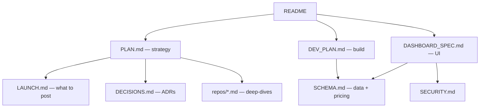

# Project Mira

A local-first, cost-near-zero engine for producing consistent, high-quality AI video content for Instagram & YouTube — faceless and (later) with-face — across English and Hindi, automatable but with you in the loop, and shareable with friends who run it on their own machines with their own keys.

- **Compute:** Mac-first (M4 Max), free cloud APIs for overflow, deliberate GPU burst (Vultr → AWS) only when needed.
- **Engine:** OpenMontage (primary, in-the-loop) + MoneyPrinterTurbo (headless volume), driven by a `mira` command layer (FastAPI + CLI) you can operate from a dashboard, Cursor/Claude, or n8n.
- **Cost:** ~$0/video on the default stack; metered tiers are opt-in and metered live.

---

## Read in this order

1. **[PLAN.md](PLAN.md)** — the strategy + architecture bible: repos, lanes, stack, cost intelligence, niches/language/quality, long-form, monetization, **§6.1 distribution / §6.2 RAM tiers / §6.3 compute swarm**, risk, roadmap. *(Start here.)*
2. **[DASHBOARD_SPEC.md](DASHBOARD_SPEC.md)** — the product/UI: 13 screens, Anthropic design, the `mira` command layer, screen connections + video lifecycle, deployment modes (solo/pod).
3. **[DEV_PLAN.md](DEV_PLAN.md)** — how we build it: command-layer-first, phases 0–9, test layers, audit gates, dependency graph.
4. **[LAUNCH.md](LAUNCH.md)** — what to actually post: starting channels, brand kits, first 30 topic seeds, week-1 run sheet.
5. **[SCHEMA.md](SCHEMA.md)** — JSON shapes (the contract-test fixtures) + a pricing snapshot.
6. **[SECURITY.md](SECURITY.md)** — secrets model, local-API hardening, Supabase RLS, licensing posture.
7. **[DECISIONS.md](DECISIONS.md)** — ADR log: every key decision + why.
8. **[repos/](repos/README.md)** — per-repo deep-dives for all 9 forked repos.

## Map

## Repo layout
- `plan/` — all planning docs (this folder).
- `repos/` — the 9 forked source repos (+ `n8n`), cloned for analysis/build.
- `dashboard/prototype.html` — early Anthropic-styled UI prototype (single file; to be extended per DASHBOARD_SPEC, refactored to Next.js+Tailwind at DEV_PLAN Phase 9).
- `research/` — scratch (currently empty).

## How to run (target — built over DEV_PLAN phases)
1. **Onboarding:** `mira setup` → detect LM Studio/ComfyUI, test API keys, set budget cap, create first channel (see [LAUNCH.md](LAUNCH.md)).
2. **Operate:** open the dashboard (localhost, or Vercel in pod mode) — or drive `mira` directly from Cursor/Claude. n8n handles scheduled/auto-publish runs.
3. **Generate → Review → Publish:** topic → `mira generate` → QA gate → schedule. Trusted channels auto-publish via MoneyPrinterTurbo headless.
4. **Pod mode (friends):** each installs the Mira Agent on their Mac/Windows with their own keys; the Vercel+Supabase coordination plane shares channels/queue/roles — **never** keys or media.

> Status: **planning complete.** Next step is DEV_PLAN Phase 0 (stand up engines + scaffold `mira` + harness). Nothing is built yet beyond the prototype shell.
