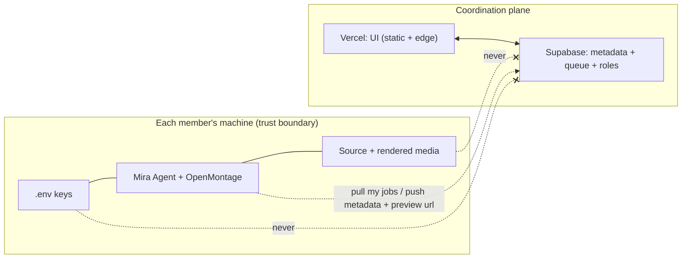

# Project Mira — Security & Compliance

Consolidates the secrets model, local-API hardening, Vercel→localhost, Supabase RLS, and licensing posture that were scattered across the other docs. This is the doc the Phase 8/9 `security-review` gate checks against.

> Companion to [`PLAN.md`](PLAN.md) §6, [`DASHBOARD_SPEC.md`](DASHBOARD_SPEC.md) deployment, [`DEV_PLAN.md`](DEV_PLAN.md) Phase 8/9.

---

## 1. Golden rule
**Secrets and media never leave the machine that owns them.** The cloud (Vercel + Supabase) only coordinates: channels, queue, roles, metadata, previews. It holds **no API keys, no source footage, no rendered video**.

## 2. Secrets handling
- All provider keys live in a **local `.env`** read by the agent (`env_loader.py`); never committed, never synced. `.gitignore` includes `.env`, `*.key`, `cost_log.json`, `media/`.
- No key is ever sent to Supabase/Vercel or to another pod member. The **swarm pools capacity, not keys** (ADR-019): a job routes to the member whose agent holds the relevant key and runs *there*.
- Key validation happens locally in onboarding ("test key" calls the provider directly from the agent).
- Optional: store keys in OS keychain (macOS Keychain / Windows Credential Manager) instead of plaintext `.env` at hardening (Phase 9).

## 3. Local API (`mira` FastAPI on localhost)
- Bind to **`127.0.0.1` only** (never `0.0.0.0`) so it isn't exposed on the LAN.
- Require a **local bearer token** (generated at `mira setup`, stored in `.env`) on every request; the local UI and n8n include it.
- **CORS:** allow only `http://localhost:*` and the specific Vercel origin in pod mode; reject others.
- Pod mode connection: the agent makes **outbound** calls to Supabase (pull jobs / push metadata) — the cloud never connects *inbound* to the agent, so no inbound ports/tunnels are opened.

## 4. Supabase (coordination DB) hardening
- **Auth:** Supabase Auth; each member is a user; a **pod** is a tenant.
- **RLS (row-level security) on every table:** a row is readable/writable only by members of its pod, and job rows only by the assigned owner + pod admin. No service-role key in the browser — UI uses the anon key + RLS; the agent uses a scoped key.
- Stored columns are **metadata only**: channel config (no keys), topic/queue items, job status, role assignments, analytics counters, **preview URLs** (short-lived signed links to the owner's storage, optional) — never raw secrets/media.
- **Single-assignment** constraint on jobs (DB-level) prevents two agents double-running the same job.
- Realtime channels scoped per-pod.

## 5. Vercel (UI) posture
- Static + edge UI; no secrets in client bundles. Any server action uses Supabase anon key under RLS.
- Environment vars in Vercel limited to public Supabase URL + anon key.

## 6. Content & platform compliance
- **AI disclosure** toggle at the Review/publish gate for realistic synthetic media (YouTube/IG synthetic-media labels); default ON for face/voice synthesis.
- **Anti-"inauthentic content":** OpenMontage `variation_checker.py` + `slideshow_risk.py` enforce structural variety; the QA gate blocks template-sameness at volume.
- **Uncensored models:** "won't refuse" ≠ "anything goes" — content policy + disclosure still apply at publish (ADR-010).
- **Music/audio:** royalty-free only (Pixabay/Freesound/local), or licensed (Suno) — flagged for monetization safety.

## 7. Licensing posture (per repo)
| Repo | License | Personal/hobby now | 🔄 At monetization |
|---|---|---|---|
| OpenMontage | AGPL-3.0 | ✅ use freely | share source only if hosting a *modified* service |
| MoneyPrinterTurbo | MIT | ✅ | ✅ |
| HyperFrames | Apache-2.0 | ✅ | ✅ |
| StoryGen-Atelier | repo LICENSE | ✅ | re-check |
| Open-Generative-AI | repo LICENSE | ✅ | re-check; Kling API is metered/commercial-ok |
| SkyReels-V2 | Skywork Community | ✅ | **re-check community terms** |
| AVTR-1 | split (renderer non-commercial) | ✅ personal only | ❌ until license changes |
| locally-uncensored | repo LICENSE | ✅ | re-check |
| n8n | Sustainable Use License | ✅ internal use | re-check if offered as a service |

## 8. Phase 8/9 security-review checklist
- [ ] No secret ever written to Supabase (inspect schema + payloads).
- [ ] RLS policies present + tested on every table; anon key can't cross pods.
- [ ] `mira` API bound to localhost + token-gated + CORS locked.
- [ ] Job single-assignment enforced at DB level.
- [ ] `.env`/media/cost logs gitignored; no keys in client bundle.
- [ ] AI-disclosure default correct; royalty-free audio enforced.
- [ ] Cloud-burst auto-teardown verified (no idle billing) + budget cap honored.
